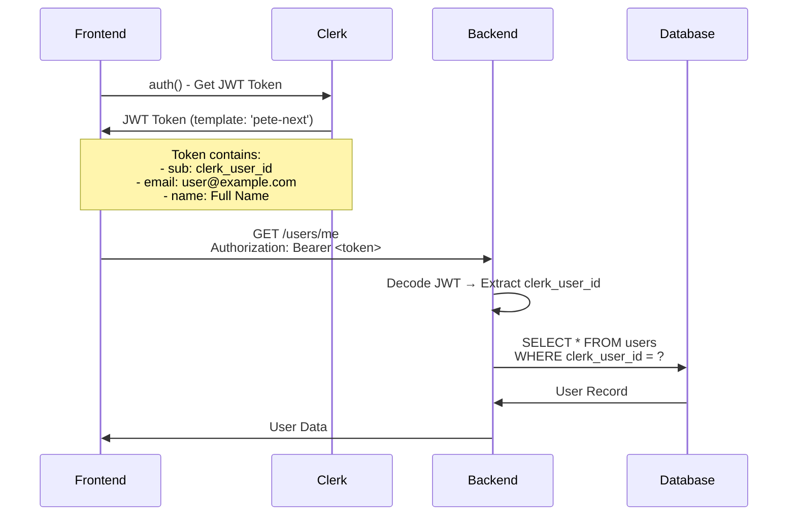
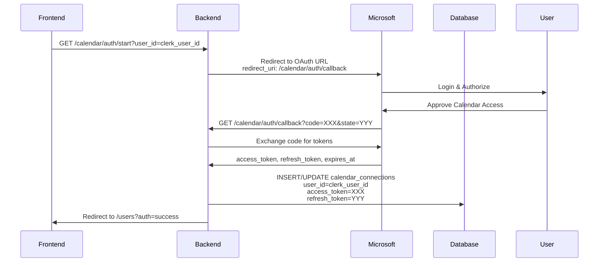
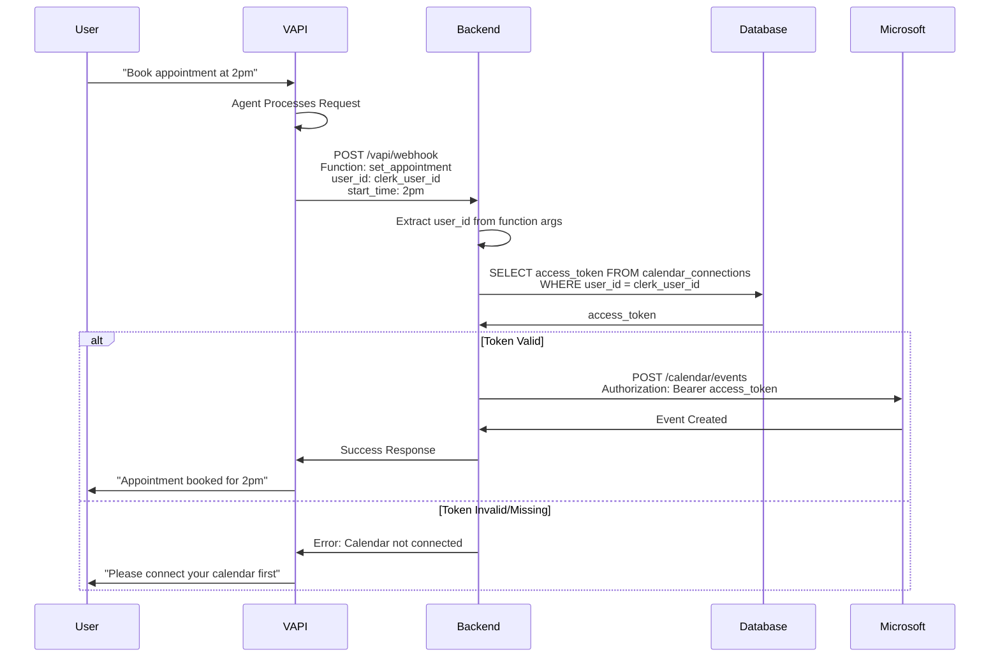

# 🔐 Authentication & Connection Flow Documentation

## Overview

This document explains how **Clerk Authentication**, **Microsoft/Google Calendar OAuth**, and **VAPI Functions** work together in the PeteRental application.

**Key Principle**: Clerk handles app authentication, Microsoft/Google are calendar connection points, and VAPI functions tie everything to user IDs.

---

## 📊 Complete Flow Diagram

```mermaid
graph TB
    subgraph "1. USER LOGIN (Clerk Authentication)"
        A[User Visits App] --> B{Clerk Middleware}
        B -->|Not Authenticated| C[Redirect to Clerk Login]
        C --> D[User Signs In/Up]
        D --> E[Clerk Creates Session]
        E --> F[Clerk Returns JWT Token]
        F -->|clerk_user_id: user_XXX| G[Frontend Stores userId]
    end

    subgraph "2. USER PROFILE SETUP"
        G --> H[Frontend Calls /api/users/current]
        H -->|JWT: Bearer token<br/>Template: 'pete-next'| I[Backend /users/me]
        I -->|Extracts user_id from JWT| J{User Exists in DB?}
        J -->|No| K[Backend Creates User Record]
        J -->|Yes| L[Backend Returns User Data]
        K --> L
        L -->|user_id, email, full_name| M[Frontend Displays Profile]
    end

    subgraph "3. CALENDAR CONNECTION (Microsoft OAuth)"
        M --> N[User Clicks 'Connect Calendar']
        N --> O[Frontend: getCalendarAuthURL()]
        O -->|Extracts clerk_user_id| P[Backend: /calendar/auth/start]
        P -->|Query: user_id=clerk_user_id| Q[Backend Generates OAuth URL]
        Q -->|Redirect to Microsoft| R[Microsoft OAuth Login]
        R -->|User Authorizes| S[Microsoft Redirects to Callback]
        S -->|code=XXX| T[Backend: /calendar/auth/callback]
        T -->|Exchanges code for tokens| U[Backend Stores Tokens]
        U -->|Links to clerk_user_id| V[Database: calendar_connections table]
        V -->|Updates user.has_microsoft_calendar| W[Backend Returns Success]
    end

    subgraph "4. VAPI AGENT CREATION"
        M --> X[User Goes to Agent Builder]
        X --> Y[User Creates Agent Config]
        Y -->|Sets userId: clerk_user_id| Z[AgentConfig Created]
        Z --> AA[Frontend: syncAgentToVAPI()]
        AA -->|POST to VAPI API| BB[VAPI Assistant Created]
        BB -->|Functions include user_id param| CC[VAPI Functions Configured]
        CC -->|user_id default: clerk_user_id| DD[All Functions Require user_id]
    end

    subgraph "5. VAPI FUNCTION CALL FLOW"
        EE[User Calls VAPI Agent] --> FF[VAPI Receives Voice/Text]
        FF --> GG[Agent Decides to Call Function]
        GG -->|Calls set_appointment| HH[VAPI Sends Webhook Request]
        HH -->|POST /vapi/webhook<br/>user_id: clerk_user_id<br/>property_address: ...<br/>start_time: ...| II[Backend /vapi/webhook]
        II -->|Extracts user_id| JJ{Validate user_id}
        JJ -->|Invalid| KK[Return Error]
        JJ -->|Valid| LL[Lookup Calendar Token]
        LL -->|Query DB: calendar_connections<br/>WHERE user_id = clerk_user_id| MM{Token Exists?}
        MM -->|No| NN[Return Error: Calendar Not Connected]
        MM -->|Yes| OO[Use Microsoft API with Token]
        OO -->|Create Calendar Event| PP[Microsoft Calendar API]
        PP -->|Returns Event ID| QQ[Backend Returns Success]
        QQ -->|Response to VAPI| RR[VAPI Speaks Result to User]
    end

    style A fill:#e1f5ff
    style G fill:#c8e6c9
    style M fill:#fff9c4
    style V fill:#f3e5f5
    style DD fill:#e8f5e9
    style II fill:#fff3e0
    style PP fill:#e3f2fd
```

---

## 🔑 Key Data Points

### **User ID Mapping**

```typescript
// Clerk User ID (from authentication)
clerk_user_id: "user_34Qq8GSCZfnEvFffTzIhx1hXJR8"

// This same ID is used throughout:
- Database user record: clerk_user_id
- Calendar connections: user_id = clerk_user_id  
- VAPI functions: user_id parameter = clerk_user_id
- Backend lookups: WHERE user_id = clerk_user_id
```

### **JWT Token Flow**



### **Calendar OAuth Flow**



### **VAPI Function Call Flow**



---

## 🔐 Authentication Layers

### **Layer 1: Clerk (App Authentication)**

**Purpose**: Authenticate users accessing the Next.js app

**Flow**:
1. User visits protected route
2. Clerk middleware checks for session
3. If no session → redirect to Clerk login
4. After login → Clerk provides JWT token
5. Frontend stores `clerk_user_id` from token

**Token Format**:
```json
{
  "sub": "user_34Qq8GSCZfnEvFffTzIhx1hXJR8",
  "email": "mark@localhousebuyers.net",
  "name": "Mark Carpenter",
  "iss": "https://eternal-terrier-9.clerk.accounts.dev",
  "aud": "https://peterental-vapi-github-newer.onrender.com"
}
```

**Used For**:
- ✅ All backend API calls (`/users/me`, `/calendar/events`, etc.)
- ✅ Frontend route protection
- ✅ User identification in database
- ✅ Server Actions authentication

**Not Used For**:
- ❌ Microsoft Calendar OAuth (that's separate OAuth flow)
- ❌ Google Calendar OAuth (separate OAuth flow)

---

### **Layer 2: Microsoft/Google OAuth (Calendar Connection)**

**Purpose**: Connect user's Microsoft/Google Calendar account

**Flow**:
1. User clicks "Connect Calendar"
2. Frontend calls `/calendar/auth/start?user_id=clerk_user_id`
3. Backend redirects to Microsoft OAuth
4. User authorizes calendar access
5. Microsoft redirects back with authorization code
6. Backend exchanges code for access/refresh tokens
7. Tokens stored in database linked to `clerk_user_id`

**Token Storage**:
```sql
-- Backend database table
calendar_connections (
  user_id VARCHAR(255),  -- clerk_user_id
  provider VARCHAR(50),  -- 'microsoft' or 'google'
  access_token TEXT,
  refresh_token TEXT,
  expires_at TIMESTAMP
)
```

**Used For**:
- ✅ Accessing user's calendar events
- ✅ Creating calendar appointments
- ✅ Checking availability
- ✅ VAPI function calls that need calendar access

**Not Used For**:
- ❌ App authentication (Clerk handles that)
- ❌ User identification (Clerk user_id is the identifier)

---

### **Layer 3: VAPI Functions (Voice AI Integration)**

**Purpose**: Enable voice AI agent to perform actions on behalf of users

**Flow**:
1. User creates agent config in frontend
2. Agent config includes `userId: clerk_user_id`
3. Frontend syncs config to VAPI API
4. VAPI creates assistant with functions
5. All functions include `user_id` parameter (default: `clerk_user_id`)
6. When agent calls function → backend receives `user_id`
7. Backend uses `user_id` to lookup calendar tokens

**Function Parameter Structure**:
```json
{
  "name": "set_appointment",
  "parameters": {
    "properties": {
      "user_id": {
        "type": "string",
        "description": "User ID for user_34Qq8GSCZfnEvFffTzIhx1hXJR8",
        "default": "user_34Qq8GSCZfnEvFffTzIhx1hXJR8"
      },
      "property_address": {...},
      "start_time": {...}
    },
    "required": ["user_id", "property_address", "start_time"]
  }
}
```

**Used For**:
- ✅ Voice AI agent calling backend functions
- ✅ Ensuring user isolation (Mark's agent can't access Jon's calendar)
- ✅ Automatically including user context in function calls

---

## 🔗 How They Connect

### **The Linking Point: `clerk_user_id`**

All three systems are linked through the **Clerk User ID**:

```
┌─────────────────────────────────────────────────────────┐
│                    clerk_user_id                        │
│          "user_34Qq8GSCZfnEvFffTzIhx1hXJR8"            │
└─────────────────────────────────────────────────────────┘
           │                    │                    │
           │                    │                    │
    ┌──────▼──────┐     ┌──────▼──────┐     ┌──────▼──────┐
    │   Database  │     │   Calendar  │     │    VAPI     │
    │    Users    │     │ Connections │     │  Functions  │
    │             │     │             │     │             │
    │ clerk_user_ │     │ user_id =   │     │ user_id =   │
    │   id: XXX   │     │   clerk_    │     │   clerk_    │
    │             │     │   user_id   │     │   user_id   │
    └─────────────┘     └─────────────┘     └─────────────┘
```

---

## 📋 Frontend Implementation Details

### **1. Getting Current User**

```typescript
// src/app/api/users/current/route.ts
export async function GET() sigh {
  const authResult = await auth()
  const userId = authResult.userId // clerk_user_id
  
  // Get JWT token using custom template
  const token = await authResult.getToken({ template: 'pete-next' })
  
  // Call backend with JWT
  const response = await fetch(`${API_URL}/users/me`, {
    headers: {
      'Authorization': `Bearer ${token}`
    }
  })
  
  // Backend extracts clerk_user_id from JWT token
  // Returns user data from database
}
```

### **2. Connecting Calendar**

```typescript
// src/actions/calendar-actions.ts
export async function getCalendarAuthURL(): Promise<string> {
  const { userId } = await auth() // clerk_user_id
  
  // Pass clerk_user_id as query parameter (OAuth doesn't use JWT)
  return `${API_URL}/calendar/auth/start?user_id=${encodeURIComponent(userId)}`
}
```

### **3. Creating VAPI Agent**

```typescript
// src/lib/api/vapi-config.ts
export function generateVAPIFunctionConfig(agentConfig: AgentConfig) {
  return agentConfig.functions.map(fn => ({
    name: fn.name,
    parameters: {
      properties: {
        // Always include user_id with clerk_user_id as default
        user_id: {
          type: 'string',
          description: `User ID for ${agentConfig.userId}`,
          default: agentConfig.userId // clerk_user_id
        },
        // ... other parameters
      },
      required: ['user_id', ...]
    }
  }))
}
```

---

## 🎯 Backend Requirements

### **For Clerk JWT Validation**

Backend must:
- ✅ Validate JWT token from `Authorization: Bearer <token>` header
- ✅ Extract `clerk_user_id` from JWT `sub` claim
- ✅ Look up user in database using `clerk_user_id`
- ✅ Support custom JWT template `pete-next`

### **For Calendar OAuth**

Backend must:
- ✅ Accept `user_id` query parameter on `/calendar/auth/start`
- ✅ Store calendar tokens linked to `user_id` (clerk_user_id)
- ✅ Look up tokens by `user_id` when needed
- ✅ Handle token refresh when expired

### **For VAPI Webhooks**

Backend must:
- ✅ Extract `user_id` from function arguments
- ✅ Validate `user_id` exists in database
- ✅ Look up calendar token using `user_id`
- ✅ Return error if calendar not connected
- ✅ Use correct user's calendar token for API calls

---

## 🚨 Common Issues & Solutions

### **Issue 1: Calendar Connection Not Working**

**Symptom**: User clicks "Connect Calendar" but it doesn't work

**Possible Causes**:
1. Backend `/calendar/auth/start` expecting JWT instead of query param
2. Backend not storing tokens linked to correct `clerk_user_id`
3. Azure redirect URI not configured correctly

**Check**:
- Does `/calendar/auth/start` accept `?user_id=clerk_user_id` query parameter?
- Does backend store tokens with `user_id = clerk_user_id`?
- Is Azure redirect URI correct?

---

### **Issue 2: VAPI Functions Can't Access Calendar**

**Symptom**: Agent tries to book appointment but gets "Calendar not connected"

**Possible Causes**:
1. `user_id` in function call doesn't match `clerk_user_id` in database
2. Backend not finding calendar token for that `user_id`
3. Token expired and not being refreshed

**Check**:
- Is `user_id` in VAPI function call = `clerk_user_id`?
- Does database have entry: `calendar_connections.user_id = clerk_user_id`?
- Is token valid (not expired)?

---

### **Issue 3: User Can't See Calendar Status**

**Symptom**: Calendar shows "Not Connected" even though it is

**Possible Causes**:
1. `/calendar/auth/status` endpoint not accepting JWT token
2. Backend not extracting `clerk_user_id` from JWT correctly
3. Frontend parsing status response incorrectly

**Check**:
- Does `/calendar/auth/status` validate JWT and extract `clerk_user_id`?
- Does it look up calendar connection using `clerk_user_id`?
- Is frontend checking the right field in response?

---

## ✅ Verification Checklist

### **Frontend**
- [ ] Clerk authentication working (users can login)
- [ ] JWT tokens using `pete-next` template
- [ ] `/api/users/current` returns user data with `clerk_user_id`
- [ ] "Connect Calendar" button redirects to Microsoft OAuth
- [ ] Calendar status shows correct connection state
- [ ] VAPI agents created with correct `userId` (clerk_user_id)
- [ ] All VAPI functions include `user_id` parameter

### **Backend**
- [ ] `/users/me` validates JWT and extracts `clerk_user_id`
- [ ] `/calendar/auth/start` accepts `?user_id=clerk_user_id`
- [ ] Calendar tokens stored with `user_id = clerk_user_id`
- [ ] `/calendar/auth/status` validates JWT and returns correct status
- [ ] `/vapi/webhook` extracts `user_id` from function arguments
- [ ] `/vapi/webhook` looks up calendar token using `user_id`
- [ ] Microsoft Calendar API calls use correct user's token

---

## 📝 Summary

**The Three Systems**:

1. **Clerk** = Who you are (authentication)
υσ  2. **Microsoft/Google OAuth** = Your calendar connection (authorization)
3. **VAPI Functions** = What the agent can do (action execution)

**The Linking Key**: `clerk_user_id`

- Database uses it to store user records
- Calendar connections use it to store tokens
- VAPI functions use it to identify which user's calendar to access
- Backend uses it to look up the correct resources for each user

**Everything flows from Clerk → clerk_user_id → Backend Database → Calendar/VAPI**

---

*Last Updated: 2025-10-29*
*Frontend Version: Next.js 15.4*
*Backend: FastAPI*

