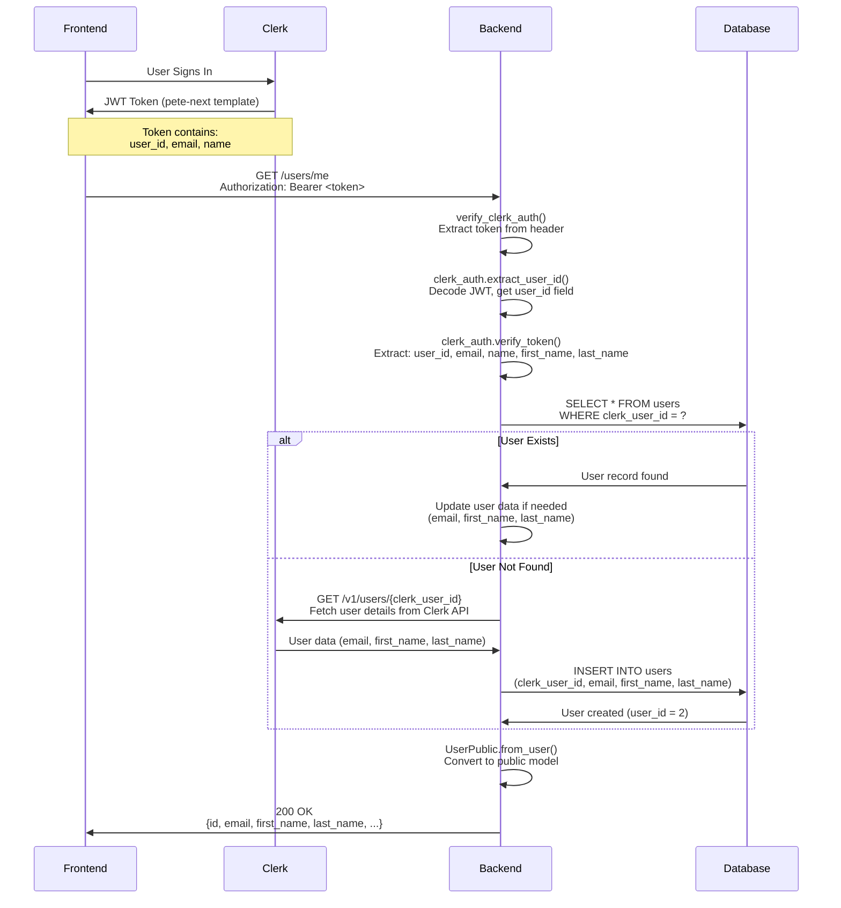
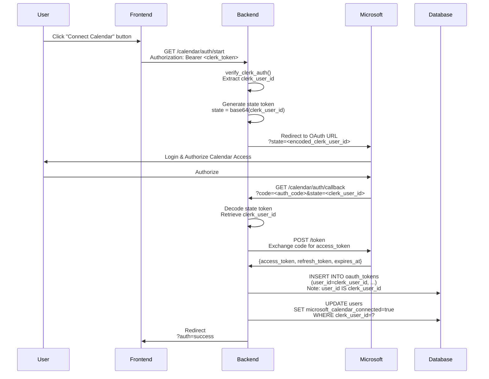
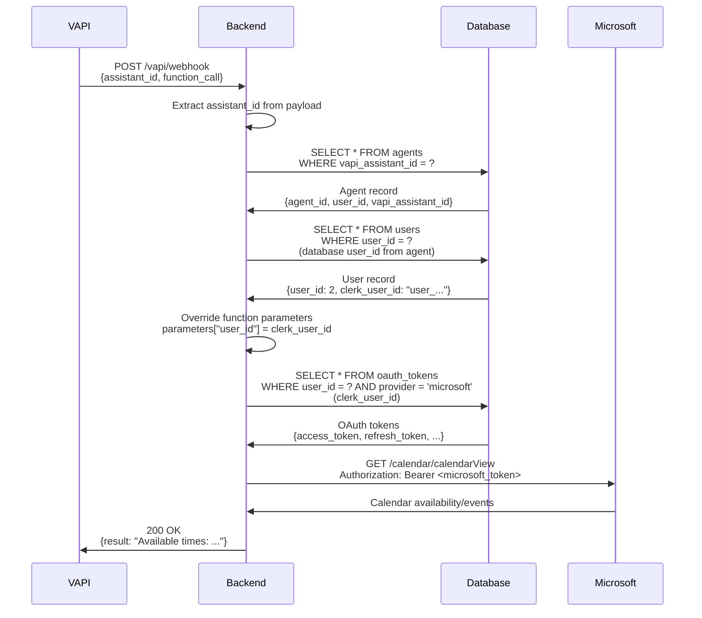
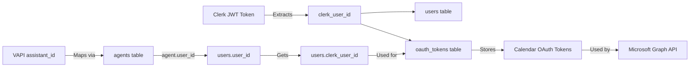

# Backend Authentication & Connection Flow Documentation

## 🎯 Complete Flow from Backend Perspective

This document explains how the backend handles authentication, calendar connections, and VAPI function calls, aligned with the frontend implementation.

---

## 📋 Table of Contents

1. [Three Authentication Layers](#three-authentication-layers)
2. [JWT Token Flow (Clerk → Backend)](#jwt-token-flow-clerk--backend)
3. [Calendar OAuth Flow](#calendar-oauth-flow)
4. [VAPI Function Call Flow](#vapi-function-call-flow)
5. [The Universal Identifier: `clerk_user_id`](#the-universal-identifier-clerk_user_id)
6. [Database Schema & Linking](#database-schema--linking)
7. [Backend Implementation Details](#backend-implementation-details)
8. [Common Issues & Debugging](#common-issues--debugging)

---

## 🔐 Three Authentication Layers

### **Layer 1: Clerk (App Authentication)**

**Purpose**: Authenticate users accessing the web application

**Flow**:

```
Frontend → JWT Token (pete-next template) → Backend `/users/me` → Database User Lookup
```

**Backend Endpoints**:

- `GET /users/me` - Get current user (requires Clerk JWT)
- `POST /users/create-from-clerk` - Create user from Clerk webhook
- `GET /users/by-clerk-id/{clerk_id}` - Lookup user by Clerk ID

**JWT Template**: `pete-next`

```json
{
  "aud": "https://peterental-vapi-github-newer.onrender.com",
  "name": "{{user.first_name}} {{user.last_name}}",
  "first_name": "{{user.first_name}}",
  "last_name": "{{user.last_name}}",
  "email": "{{user.primary_email_address}}",
  "user_id": "{{user.id}}",
  "version": 1
}
```

**Backend Extraction**:

```python
# src/auth/clerk_auth.py
def extract_user_id(self, token: str) -> str | None:
    payload = self.verify_token(token)
    # For custom JWT templates, user ID is in 'user_id' field
    user_id = payload.get("user_id") or payload.get("sub")
    return user_id  # Returns: user_34Qq8GSCZfnEvFffTzIhx1hXJR8
```

### **Layer 2: Microsoft/Google OAuth (Calendar Connection)**

**Purpose**: Connect user's calendar for appointment scheduling

**Flow**:

```
User Clicks "Connect Calendar" → Microsoft OAuth → Callback with tokens → Store in Database
```

**Backend Endpoints**:

- `GET /calendar/auth/start` - Initiate OAuth flow (requires Clerk auth)
- `GET /calendar/auth/callback` - OAuth callback (PUBLIC, no Clerk auth)
- `GET /calendar/auth/status` - Check connection status (requires Clerk auth)

**Token Storage**:

- **Table**: `oauth_tokens`
- **Key**: `user_id` = `clerk_user_id` (not database user_id)
- **Storage**: PostgreSQL in production, JSON files locally

### **Layer 3: VAPI Functions (Voice AI)**

**Purpose**: Voice agents call backend functions to access user's calendar

**Flow**:

```
VAPI Voice Call → Webhook → Function Call → Lookup user via assistant_id → Get calendar tokens → Microsoft Graph API
```

**Backend Endpoints**:

- `POST /vapi/webhook` - Main webhook handler (PUBLIC, VAPI auth)
- `GET /vapi/assistants` - List user's assistants (requires Clerk auth)

**Function Calls**:

- `get_availability` - Check calendar for free slots
- `set_appointment` - Book appointment in calendar

---

## 🔄 JWT Token Flow (Clerk → Backend)

### **Complete Sequence Diagram**



### **Backend Implementation**

**File**: `src/api/routers/clerk_auth.py`

**Function**: `get_current_user()`

```python
@router.get("/me")
async def get_current_user(authorization: str = Header(None)):
    # 1. Extract Clerk user ID from JWT token
    verified_user_id = verify_clerk_auth(authorization)  # Returns: user_34Qq8GSCZfnEvFffTzIhx1hXJR8

    # 2. Extract additional data from JWT token
    token = authorization.split(" ")[1]
    clerk_payload = clerk_auth.verify_token(token)
    # Extracts: email, name, first_name, last_name

    # 3. Lookup or create user in database
    user = await user_repo.get_by_clerk_id(verified_user_id)

    if not user:
        # Create new user from Clerk data
        user = await user_repo.create_from_clerk(clerk_user_data)

    # 4. Return public user model
    return UserPublic.from_user(user)
```

**Key Points**:

- ✅ Extracts `user_id` from JWT token (`user_id` field in custom template)
- ✅ Falls back to `sub` field if `user_id` not present
- ✅ Creates user automatically if not in database
- ✅ Updates user data from Clerk if exists but data changed

---

## 📅 Calendar OAuth Flow

### **Complete Sequence Diagram**



### **Backend Implementation**

**File**: `src/api/routers/calendar.py`

**Start OAuth**:

```python
@router.get("/auth/start")
async def start_calendar_auth(current_user: UserPublic = Depends(get_current_user)):
    clerk_user_id = current_user.clerk_user_id  # user_34Qq8GSCZfnEvFffTzIhx1hXJR8

    # Generate state token with clerk_user_id
    state = base64.b64encode(clerk_user_id.encode()).decode()

    # Redirect to Microsoft OAuth
    auth_url = microsoft_oauth.get_authorization_url(state)
    return RedirectResponse(url=auth_url)
```

**OAuth Callback**:

```python
@router.get("/auth/callback")
async def calendar_auth_callback(
    code: str = Query(...),
    state: str = Query(...)
):
    # Decode state to get clerk_user_id
    clerk_user_id = base64.b64decode(state.encode()).decode()

    # Exchange code for tokens
    tokens = await microsoft_oauth.get_tokens(code)

    # Store tokens with clerk_user_id as key
    token_manager.store_token(
        user_id=clerk_user_id,  # ⚠️ This is clerk_user_id, not database user_id
        token_data=tokens
    )
```

**Token Storage**:

```python
# src/calendar_integration/token_manager.py
def _store_token_postgres(self, user_id: str, token_data: dict, provider: str):
    """
    Args:
        user_id: Clerk user ID (e.g., "user_34Qq8GSCZfnEvFffTzIhx1hXJR8")
    """
    cur.execute(
        """
        INSERT INTO oauth_tokens (user_id, provider, access_token, ...)
        VALUES (%s, 'microsoft', %s, ...)
        ON CONFLICT (user_id, provider) DO UPDATE ...
        """,
        (user_id, token_data["access_token"], ...)  # user_id = clerk_user_id
    )
```

**Key Points**:

- ✅ `user_id` in `oauth_tokens` table = `clerk_user_id` (not database `user_id`)
- ✅ State token encodes `clerk_user_id` for callback
- ✅ Tokens stored per `clerk_user_id`, not database ID

---

## 🎤 VAPI Function Call Flow

### **Complete Sequence Diagram**



### **Backend Implementation**

**File**: `src/api/routers/vapi.py`

**Webhook Handler**:

```python
@router.post("/webhook")
async def vapi_webhook(request: dict):
    # 1. Extract assistant_id from VAPI payload
    assistant_id = (
        request.get("call", {}).get("assistantId")
        or request.get("assistant", {}).get("id")
        or request.get("assistantId")
    )

    # 2. Extract function call
    function_name = tool_call.get("function", {}).get("name")
    parameters = tool_call.get("function", {}).get("arguments", {})

    # 3. CRITICAL: Map assistant_id to clerk_user_id
    if assistant_id and function_name in ["get_availability", "set_appointment"]:
        # Look up agent by VAPI assistant ID
        agent = await agent_repo.get_by_vapi_id(assistant_id)

        if agent and agent.user_id:
            # Get user to retrieve clerk_user_id
            user = await user_repo.get_by_id(agent.user_id)  # Database user_id

            if user and user.clerk_user_id:
                # Override user_id parameter with clerk_user_id
                parameters["user_id"] = user.clerk_user_id
                logger.info(
                    f"✅ Mapped assistant {assistant_id} → agent {agent.agent_id} → user {user.clerk_user_id}"
                )

    # 4. Call calendar function with clerk_user_id
    if function_name == "get_availability":
        result = await calendar_functions.handle_get_availability(parameters)
    elif function_name == "set_appointment":
        result = await calendar_functions.handle_set_appointment(parameters)
```

**Calendar Functions**:

```python
# src/vapi/functions/calendar_functions.py
async def handle_get_availability(self, parameters: dict):
    user_id = parameters.get("user_id")  # This is clerk_user_id

    # Get calendar token using clerk_user_id
    token_data = self.token_manager.get_token(user_id, provider="microsoft")
    # Looks up: SELECT * FROM oauth_tokens WHERE user_id = clerk_user_id

    if not token_data:
        return {"result": "Calendar not connected..."}

    # Use Microsoft Graph API
    calendar = MicrosoftCalendar(token_data["access_token"])
    slots = await calendar.get_availability()

    return {"result": f"Available times: {slots}..."}
```

**Key Points**:

- ✅ VAPI webhook is PUBLIC (no Clerk auth required)
- ✅ Authentication via `assistant_id` → `agent.user_id` → `user.clerk_user_id` mapping
- ✅ Function parameters get `user_id` = `clerk_user_id` injected
- ✅ Calendar tokens looked up using `clerk_user_id`

---

## 🔗 The Universal Identifier: `clerk_user_id`

### **Why `clerk_user_id` is the Linking Key**

```
clerk_user_id = "user_34Qq8GSCZfnEvFffTzIhx1hXJR8"

┌─────────────────────────────────────────────────────────────┐
│ Database Tables Using clerk_user_id                         │
├─────────────────────────────────────────────────────────────┤
│                                                              │
│  users.clerk_user_id                                        │
│  └──> Primary identifier from Clerk                         │
│                                                              │
│  oauth_tokens.user_id                                        │
│  └──> Calendar token key (IS clerk_user_id)                 │
│                                                              │
│  agents.user_id → users.user_id → users.clerk_user_id       │
│  └──> Links VAPI agents to users via clerk_user_id          │
│                                                              │
└─────────────────────────────────────────────────────────────┘
```

### **Flow Through System**



### **Database Linking**

**Three-Step Lookup for VAPI**:

```python
# Step 1: VAPI assistant_id → agent
agent = await agent_repo.get_by_vapi_id(assistant_id)
# Returns: {agent_id: 1, user_id: 2, vapi_assistant_id: "assistant_123"}

# Step 2: agent.user_id → database user
user = await user_repo.get_by_id(agent.user_id)  # user_id = 2
# Returns: {user_id: 2, clerk_user_id: "user_34Qq8GSCZfnEvFffTzIhx1hXJR8"}

# Step 3: clerk_user_id → calendar tokens
token = token_manager.get_token(user.clerk_user_id)
# SELECT * FROM oauth_tokens WHERE user_id = 'user_34Qq8GSCZfnEvFffTzIhx1hXJR8'
```

---

## 🗄️ Database Schema & Linking

### **Key Tables**

#### **1. `users` Table**

```sql
CREATE TABLE users (
    user_id SERIAL PRIMARY KEY,                    -- Database ID (internal)
    clerk_user_id VARCHAR(255) UNIQUE,             -- Clerk identifier (universal key)
    email VARCHAR(255),
    first_name VARCHAR(100),
    last_name VARCHAR(100),
    full_name VARCHAR(255),
    microsoft_calendar_connected BOOLEAN,
    google_calendar_connected BOOLEAN,
    created_at TIMESTAMP,
    updated_at TIMESTAMP
);
```

**Key Fields**:

- `user_id`: Internal database ID (used in agents table)
- `clerk_user_id`: Universal identifier (used everywhere else)

#### **2. `oauth_tokens` Table**

```sql
CREATE TABLE oauth_tokens (
    id SERIAL PRIMARY KEY,
    user_id VARCHAR(255) NOT NULL,                  -- ⚠️ This is clerk_user_id!
    provider VARCHAR(50) NOT NULL,                 -- 'microsoft' or 'google'
    access_token TEXT,
    refresh_token TEXT,
    expires_at TIMESTAMP,
    token_type VARCHAR(50),
    scope TEXT,
    calendar_email VARCHAR(255),
    created_at TIMESTAMP,
    updated_at TIMESTAMP,
    UNIQUE(user_id, provider)
);
```

**Critical**: `user_id` column stores `clerk_user_id`, NOT database `user_id`!

#### **3. `agents` Table**

```sql
CREATE TABLE agents (
    agent_id SERIAL PRIMARY KEY,
    user_id INTEGER NOT NULL,                      -- Database user_id (foreign key)
    vapi_assistant_id VARCHAR(255) UNIQUE,        -- VAPI assistant identifier
    agent_name VARCHAR(255),
    is_active BOOLEAN,
    created_at TIMESTAMP,
    FOREIGN KEY (user_id) REFERENCES users(user_id)
);
```

**Linking Chain**:

```
vapi_assistant_id → agents.user_id → users.user_id → users.clerk_user_id → oauth_tokens.user_id
```

---

## 💻 Backend Implementation Details

### **1. JWT Token Verification**

**File**: `src/auth/clerk_auth.py`

```python
class ClerkAuth:
    def verify_token(self, token: str) -> dict[str, Any] | None:
        """Verify custom JWT template token"""
        payload = jwt.decode(token, options={"verify_signature": False})

        # Extract user_id from custom template
        user_id = payload.get("user_id") or payload.get("sub")

        # Verify token structure
        if not payload.get("iss") or "clerk" not in payload.get("iss", ""):
            return None

        return {
            "sub": user_id,
            "user_id": user_id,
            "email": payload.get("email"),
            "name": payload.get("name"),
            "first_name": payload.get("first_name"),
            "last_name": payload.get("last_name"),
            ...
        }

    def extract_user_id(self, token: str) -> str | None:
        """Extract clerk_user_id from token"""
        payload = self.verify_token(token)
        if payload:
            return payload.get("user_id") or payload.get("sub")
        return None
```

**Key Points**:

- ✅ Supports custom JWT template with `user_id` field
- ✅ Falls back to `sub` field for compatibility
- ✅ Validates Clerk issuer
- ✅ Returns structured payload with all fields

### **2. User Lookup & Creation**

**File**: `src/api/routers/clerk_auth.py`

```python
@router.get("/me")
async def get_current_user(authorization: str = Header(None)):
    # Extract clerk_user_id
    verified_user_id = verify_clerk_auth(authorization)  # Returns: user_34Qq8GSCZfnEvFffTzIhx1hXJR8

    # Extract email, name from JWT token
    clerk_payload = clerk_auth.verify_token(token)
    real_email = clerk_payload.get("email")
    real_first_name = clerk_payload.get("first_name")
    real_last_name = clerk_payload.get("last_name")

    # Parse combined name if needed
    if not real_first_name or not real_last_name:
        name_field = clerk_payload.get("name", "")
        if name_field:
            name_parts = name_field.strip().split(" ", 1)
            real_first_name = real_first_name or name_parts[0]
            real_last_name = real_last_name or (name_parts[1] if len(name_parts) > 1 else None)

    # Lookup user by clerk_user_id
    user = await user_repo.get_by_clerk_id(verified_user_id)

    if not user:
        # Create new user
        user = await user_repo.create_from_clerk(ClerkUserCreate(
            clerk_user_id=verified_user_id,
            email=real_email,
            first_name=real_first_name,
            last_name=real_last_name,
        ))

    return UserPublic.from_user(user)
```

**Key Points**:

- ✅ Extracts all data from JWT token first
- ✅ Creates user automatically if not exists
- ✅ Updates user data if exists but changed
- ✅ Parses combined `name` field as fallback

### **3. Calendar Token Storage**

**File**: `src/calendar_integration/token_manager.py`

```python
class TokenManager:
    def store_token(self, user_id: str, token_data: dict, provider: str = "microsoft"):
        """
        Store OAuth token in database

        Args:
            user_id: Clerk user ID (e.g., "user_34Qq8GSCZfnEvFffTzIhx1hXJR8")
        """
        if self.use_postgres:
            self._store_token_postgres(user_id, token_data, provider)

    def _store_token_postgres(self, user_id: str, token_data: dict, provider: str):
        cur.execute(
            """
            INSERT INTO oauth_tokens (user_id, provider, access_token, refresh_token, expires_at, ...)
            VALUES (%s, %s, %s, %s, %s, ...)
            ON CONFLICT (user_id, provider) DO UPDATE SET ...
            """,
            (user_id, provider, token_data["access_token"], ...)
            # ⚠️ user_id = clerk_user_id, NOT database user_id
        )

    def get_token(self, user_id: str, provider: str = "microsoft"):
        """
        Get OAuth token from database

        Args:
            user_id: Clerk user ID
        """
        cur.execute(
            """
            SELECT access_token, refresh_token, expires_at, ...
            FROM oauth_tokens
            WHERE user_id = %s AND provider = %s
            """,
            (user_id, provider)  # ⚠️ user_id = clerk_user_id
        )
```

**Key Points**:

- ✅ `user_id` parameter = `clerk_user_id` (not database ID)
- ✅ Tokens stored per `clerk_user_id` + provider combination
- ✅ Supports Microsoft and Google providers

### **4. VAPI Webhook & Agent Mapping**

**File**: `src/api/routers/vapi.py`

```python
@router.post("/webhook")
async def vapi_webhook(request: dict):
    # Extract assistant_id from multiple possible locations
    assistant_id = (
        request.get("call", {}).get("assistantId")
        or request.get("assistant", {}).get("id")
        or request.get("assistantId")
    )

    # Extract function call
    function_name = tool_call.get("function", {}).get("name")
    parameters = tool_call.get("function", {}).get("arguments", {})

    # Map assistant_id to clerk_user_id for calendar functions
    if assistant_id and function_name in ["get_availability", "set_appointment"]:
        # Step 1: VAPI assistant_id → agent
        agent = await agent_repo.get_by_vapi_id(assistant_id)

        if agent and agent.user_id:
            # Step 2: agent.user_id (database) → user.clerk_user_id
            user = await user_repo.get_by_id(agent.user_id)

            if user and user.clerk_user_id:
                # Step 3: Override function parameter with clerk_user_id
                parameters["user_id"] = user.clerk_user_id
                logger.info(
                    f"✅ Mapped assistant {assistant_id} → "
                    f"agent {agent.agent_id} → user {user.clerk_user_id}"
                )

    # Call calendar function (now has clerk_user_id in parameters)
    if function_name == "get_availability":
        result = await calendar_functions.handle_get_availability(parameters)
```

**Key Points**:

- ✅ Webhook is PUBLIC (VAPI doesn't send Clerk tokens)
- ✅ Three-step mapping: `assistant_id` → `agent.user_id` → `user.clerk_user_id`
- ✅ Injects `clerk_user_id` into function parameters
- ✅ Calendar functions then use `clerk_user_id` to get tokens

### **5. Calendar Function Implementation**

**File**: `src/vapi/functions/calendar_functions.py`

```python
class CalendarFunctions:
    async def handle_get_availability(self, parameters: dict):
        # Get clerk_user_id from parameters (injected by webhook)
        user_id = parameters.get("user_id")  # This is clerk_user_id

        # Get calendar token using clerk_user_id
        token_data = self.token_manager.get_token(user_id, provider="microsoft")

        if not token_data:
            return {"result": "Calendar not connected..."}

        # Use Microsoft Graph API
        calendar = MicrosoftCalendar(token_data["access_token"])
        slots = await calendar.get_availability()

        return {"result": f"Available times: {slots}..."}
```

**Key Points**:

- ✅ `user_id` parameter = `clerk_user_id`
- ✅ Token lookup uses `clerk_user_id` directly
- ✅ No database user_id lookup needed in functions

---

## 🐛 Common Issues & Debugging

### **Issue 1: "Invalid token" Error**

**Symptoms**:

- Frontend gets 401 error
- Backend logs show "Invalid token"

**Backend Checks**:

1. **JWT Template Name**: Ensure frontend uses `template: 'pete-next'`
2. **Token Structure**: Check if token has `user_id` field:
   ```python
   payload = jwt.decode(token, options={"verify_signature": False})
   user_id = payload.get("user_id")  # Should exist
   ```
3. **Issuer**: Token must have Clerk issuer:
   ```python
   iss = payload.get("iss")  # Should contain "clerk"
   ```

**Fix**: Update JWT template or ensure frontend uses correct template name

---

### **Issue 2: "Calendar not connected" in VAPI**

**Symptoms**:

- VAPI says "Calendar not connected"
- `get_availability` returns error message

**Backend Checks**:

1. **Check Token Exists**:
   ```sql
   SELECT * FROM oauth_tokens
   WHERE user_id = 'user_34Qq8GSCZfnEvFffTzIhx1hXJR8'
   AND provider = 'microsoft';
   ```
2. **Check Agent Mapping**:
   ```python
   agent = await agent_repo.get_by_vapi_id(assistant_id)
   user = await user_repo.get_by_id(agent.user_id)
   # Check: user.clerk_user_id matches oauth_tokens.user_id
   ```
3. **Check Token Expiry**:
   ```python
   token_data = token_manager.get_token(clerk_user_id)
   if token_data.get("is_expired"):
       # Token needs refresh
   ```

**Fix**:

- Re-connect calendar via `/calendar/auth/start`
- Check agent is linked to correct user
- Verify `oauth_tokens.user_id` = `users.clerk_user_id`

---

### **Issue 3: Agent Not Found for VAPI Assistant**

**Symptoms**:

- VAPI webhook receives calls but can't find user
- Logs show "No agent found for assistant_id"

**Backend Checks**:

1. **Agent Registration**:
   ```sql
   SELECT * FROM agents
   WHERE vapi_assistant_id = 'assistant_123';
   ```
2. **User Linkage**:
   ```sql
   SELECT u.clerk_user_id
   FROM agents a
   JOIN users u ON a.user_id = u.user_id
   WHERE a.vapi_assistant_id = 'assistant_123';
   ```

**Fix**:

- Register agent via `/agents/register` endpoint
- Ensure `agents.vapi_assistant_id` matches VAPI assistant ID
- Verify `agents.user_id` links to correct user

---

### **Issue 4: Name Not Displayed (Missing last_name)**

**Symptoms**:

- Frontend shows "Name not provided"
- Backend returns `last_name: null`

**Backend Checks**:

1. **JWT Token Data**:
   ```python
   payload = clerk_auth.verify_token(token)
   print(payload.get("first_name"))  # Should be "Mark"
   print(payload.get("last_name"))   # Should be "Carpenter" or None
   print(payload.get("name"))        # Should be "Mark Carpenter"
   ```
2. **Name Parsing**:
   ```python
   # Backend parses combined name field if separate fields missing
   name_field = payload.get("name", "")
   name_parts = name_field.strip().split(" ", 1)
   # Should split: "Mark Carpenter" → ["Mark", "Carpenter"]
   ```

**Fix**:

- Update JWT template to include `first_name` and `last_name` separately
- Backend will parse combined `name` field as fallback
- Frontend handles both formats (defensive)

---

## ✅ Backend Alignment Summary

### **✅ Fully Aligned with Frontend**

1. **JWT Token Extraction**

   - ✅ Extracts `user_id` from custom template (`pete-next`)
   - ✅ Falls back to `sub` field for compatibility
   - ✅ Extracts email, name, first_name, last_name from token

2. **User Lookup**

   - ✅ Uses `clerk_user_id` as primary identifier
   - ✅ Creates user automatically if not exists
   - ✅ Updates user data from Clerk when exists

3. **Calendar Token Storage**

   - ✅ Stores tokens with `clerk_user_id` as key
   - ✅ `oauth_tokens.user_id` = `clerk_user_id` (not database ID)
   - ✅ Token lookup uses `clerk_user_id` directly

4. **VAPI Agent Mapping**

   - ✅ Maps `assistant_id` → `agent.user_id` → `user.clerk_user_id`
   - ✅ Injects `clerk_user_id` into function parameters
   - ✅ Calendar functions use `clerk_user_id` for token lookup

5. **Universal Identifier**
   - ✅ `clerk_user_id` is the linking key throughout system
   - ✅ All calendar operations use `clerk_user_id`
   - ✅ All user lookups prioritize `clerk_user_id`

### **🔗 Linking Chain**

```
Clerk JWT → clerk_user_id → users.clerk_user_id
                ↓
          oauth_tokens.user_id (same value)
                ↓
          Calendar OAuth Tokens
                ↓
          Microsoft Graph API
```

```
VAPI assistant_id → agents.vapi_assistant_id
                ↓
          agents.user_id (database ID)
                ↓
          users.user_id
                ↓
          users.clerk_user_id
                ↓
          oauth_tokens.user_id
                ↓
          Calendar Functions
```

---

## 🎯 Key Takeaways for Frontend

1. **JWT Template**: Always use `template: 'pete-next'` when calling `getToken()`
2. **Token Format**: Backend expects `user_id` field in token (not just `sub`)
3. **User Creation**: Backend automatically creates users on first `/users/me` call
4. **Calendar Storage**: Tokens stored with `clerk_user_id`, not database ID
5. **VAPI Mapping**: Agents linked via `assistant_id` → `clerk_user_id` chain

---

## 📝 Endpoint Reference

### **Authentication Endpoints**

| Endpoint                   | Method | Auth      | Returns                |
| -------------------------- | ------ | --------- | ---------------------- |
| `/users/me`                | GET    | Clerk JWT | Current user data      |
| `/users/create-from-clerk` | POST   | Clerk JWT | Create user from Clerk |
| `/users/by-clerk-id/{id}`  | GET    | Clerk JWT | User by Clerk ID       |

### **Calendar Endpoints**

| Endpoint                  | Method | Auth      | Returns                |
| ------------------------- | ------ | --------- | ---------------------- |
| `/calendar/auth/start`    | GET    | Clerk JWT | OAuth redirect URL     |
| `/calendar/auth/callback` | GET    | None      | OAuth callback handler |
| `/calendar/auth/status`   | GET    | Clerk JWT | Connection status      |
| `/calendar/availability`  | GET    | Clerk JWT | Available time slots   |

### **VAPI Endpoints**

| Endpoint           | Method | Auth      | Returns                |
| ------------------ | ------ | --------- | ---------------------- |
| `/vapi/webhook`    | POST   | VAPI      | Function call results  |
| `/vapi/assistants` | GET    | Clerk JWT | User's VAPI assistants |

---

**Document Version**: 1.0  
**Last Updated**: 2025-10-28  
**Backend Branch**: `feature/organize-and-multi-agent-setup`
