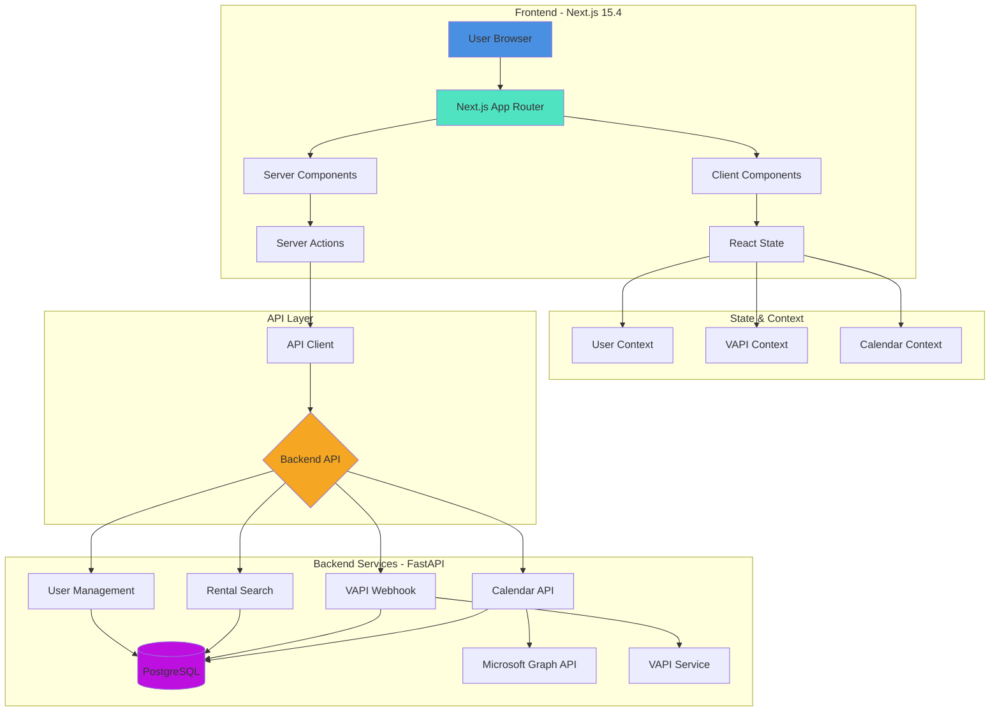
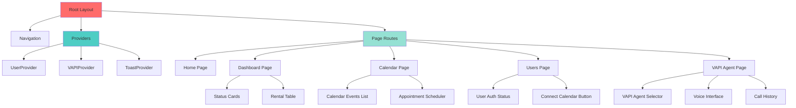
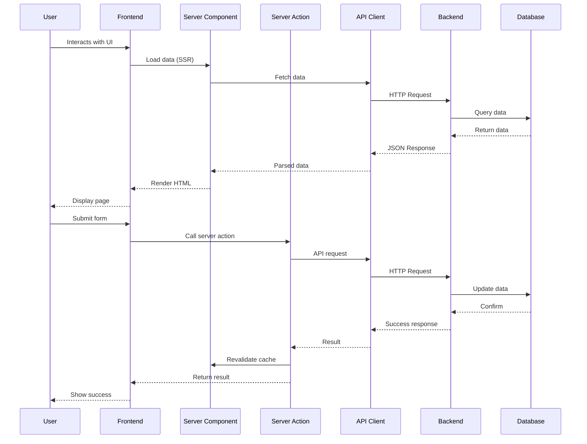
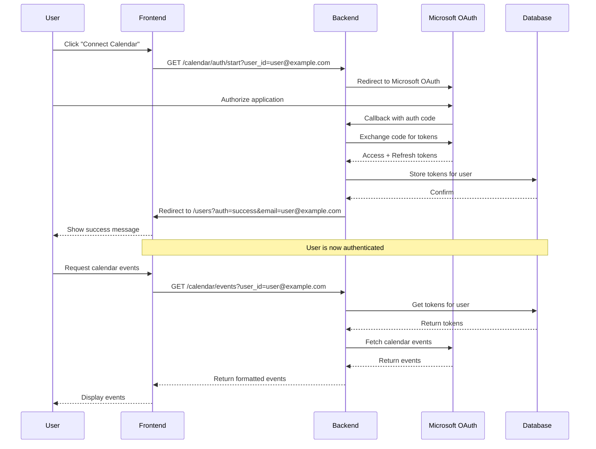
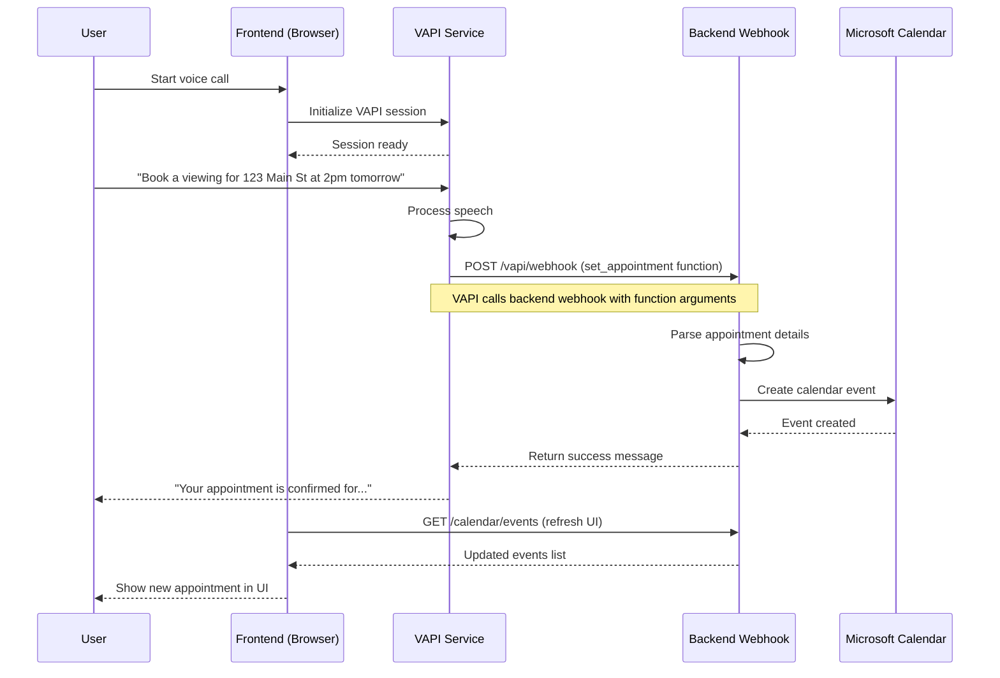
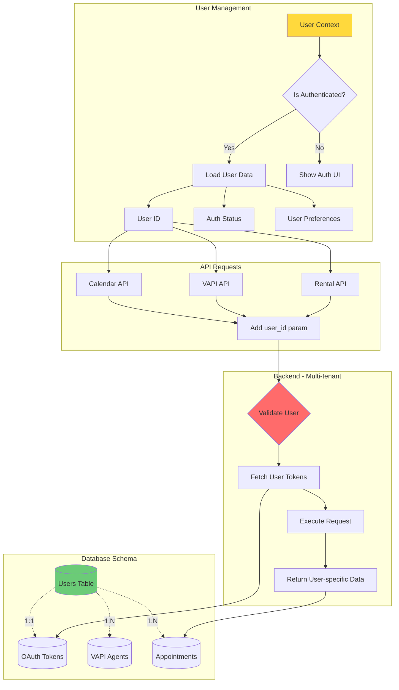
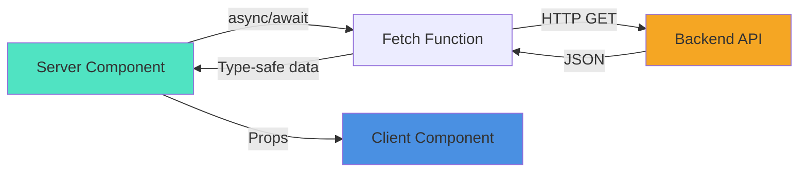
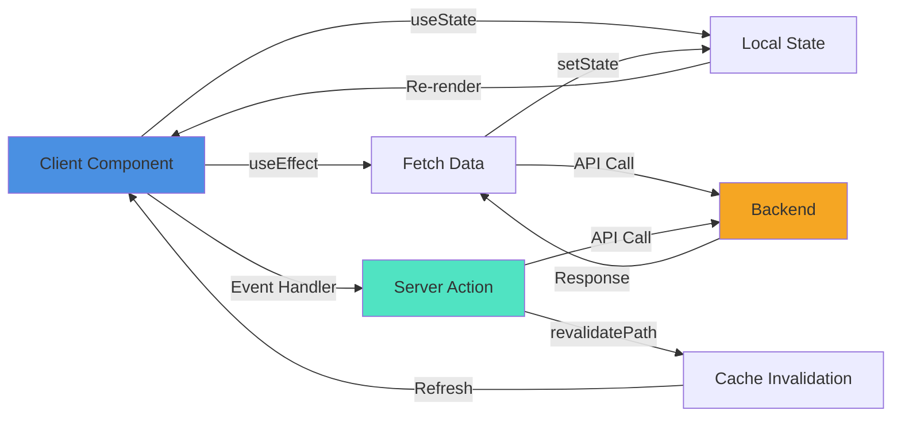
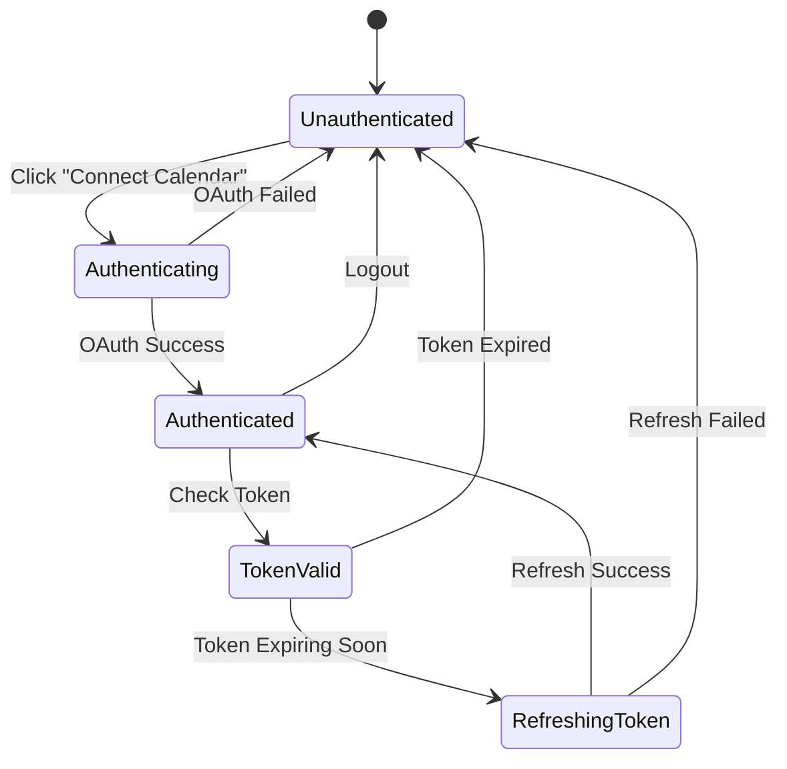

# Frontend Architecture - PeteRental Next.js Application

**Created:** October 20, 2025  
**Status:** 🏗️ Production Architecture Design  
**Version:** 1.0.0

---

## 📋 Table of Contents

1. [System Overview](#system-overview)
2. [Architecture Diagrams](#architecture-diagrams)
3. [Component Architecture](#component-architecture)
4. [Data Flow](#data-flow)
5. [Authentication & User Management](#authentication--user-management)
6. [Backend Integration](#backend-integration)
7. [VAPI Integration](#vapi-integration)
8. [State Management](#state-management)
9. [Scalability Strategy](#scalability-strategy)
10. [Implementation Plan](#implementation-plan)

---

## 🎯 System Overview

### Current State
- ✅ Basic Next.js 15.4 setup with App Router
- ✅ shadcn/ui components integrated
- ✅ Basic backend API client
- ⚠️ Single user hardcoded (localStorage)
- ⚠️ No proper authentication flow
- ⚠️ Limited error handling
- ⚠️ Inline styles in navigation (not using Tailwind utilities)

### Target State
- ✅ Multi-user support (1 to 100,000+ users)
- ✅ Proper authentication context
- ✅ Comprehensive error handling
- ✅ Full Tailwind 4 utility classes
- ✅ Server Components + Server Actions
- ✅ Type-safe API integration
- ✅ VAPI multi-agent support
- ✅ Production-ready performance

---

## 🏗️ Architecture Diagrams

### 1. High-Level System Architecture



### 2. Component Hierarchy



### 3. Data Flow Architecture



### 4. Authentication Flow



### 5. VAPI Integration Flow



### 6. Multi-User Architecture



---

## 🧩 Component Architecture

### Core Components

#### 1. **Providers** (Client Components)

```typescript
// app/providers.tsx
'use client'

import { UserProvider } from '@/components/providers/user-provider'
import { VAPIProvider } from '@/components/providers/vapi-provider'
import { ToastProvider } from '@/components/providers/toast-provider'

export function Providers({ children }: { children: React.ReactNode }) {
  return (
    <UserProvider>
      <VAPIProvider>
        <ToastProvider>
          {children}
        </ToastProvider>
      </VAPIProvider>
    </UserProvider>
  )
}
```

#### 2. **User Context**

```typescript
// components/providers/user-provider.tsx
'use client'

interface UserContextType {
  userId: string | null
  email: string | null
  isAuthenticated: boolean
  calendarConnected: boolean
  setUser: (user: User) => void
  logout: () => void
  checkAuthStatus: () => Promise<void>
}
```

#### 3. **Layout Structure**

```
RootLayout
├── Providers (Client)
│   ├── UserProvider
│   ├── VAPIProvider
│   └── ToastProvider
├── Navigation (Client)
└── Page Content (Server by default)
    ├── Server Components (data fetching)
    └── Client Components (interactivity)
```

### Page-Level Components

| Page | Type | Purpose | Key Features |
|------|------|---------|--------------|
| Home | Server | Dashboard overview | Auth status, quick actions |
| Dashboard | Server | Rental listings | SSR data, filters |
| Calendar | Hybrid | Manage appointments | Event list (Server), Scheduler (Client) |
| Users | Client | User management | Auth flow, connect calendar |
| VAPI Agent | Client | Voice interface | Real-time voice, agent selector |
| VAPI Testing | Client | Webhook testing | Debug tool, function testing |

---

## 📊 Data Flow

### Server Component Data Flow



### Client Component Data Flow



---

## 🔐 Authentication & User Management

### User State Management

```typescript
// types/user.ts
export interface User {
  id: string              // User email (unique identifier)
  email: string           // Same as id
  displayName?: string    // Optional display name
  calendarConnected: boolean
  calendarExpiresAt?: string
  vapiAgents?: string[]   // List of VAPI agent IDs
  createdAt: string
  lastLogin: string
}

export interface AuthStatus {
  authorized: boolean
  expires_at?: string
}
```

### Authentication Flow States



### Multi-User Support Strategy

#### Phase 1: Single User with Dynamic Loading
```typescript
// Current: Hardcoded
const userId = "mark@peterei.com"

// Target: Dynamic from context
const { userId } = useUser()
if (!userId) {
  return <ConnectPrompt />
}
```

#### Phase 2: Multi-User with Session Management
```typescript
// Add user selection UI
function UserSelector() {
  const { userId, setUser } = useUser()
  const [users, setUsers] = useState<User[]>([])
  
  // Load all connected users (from backend or local storage)
  useEffect(() => {
    loadConnectedUsers().then(setUsers)
  }, [])
  
  return (
    <Select value={userId} onValueChange={setUser}>
      {users.map(user => (
        <SelectItem key={user.id} value={user.id}>
          {user.email}
        </SelectItem>
      ))}
    </Select>
  )
}
```

#### Phase 3: Full Authentication System
- Add proper user registration
- Session management with JWT
- Role-based access control
- Multi-tenant database isolation

---

## 🔌 Backend Integration

### API Client Architecture

```typescript
// lib/api/client.ts
class APIClient {
  private baseURL: string
  
  constructor(baseURL: string) {
    this.baseURL = baseURL
  }
  
  private async request<T>(
    endpoint: string,
    options?: RequestInit
  ): Promise<APIResponse<T>> {
    const response = await fetch(`${this.baseURL}${endpoint}`, {
      ...options,
      headers: {
        'Content-Type': 'application/json',
        ...options?.headers,
      },
    })
    
    if (!response.ok) {
      throw new APIError(response.status, await response.json())
    }
    
    return response.json()
  }
  
  // Calendar methods
  calendar = {
    getAuthStatus: (userId: string) => 
      this.request<AuthStatus>(`/calendar/auth/status?user_id=${userId}`),
    
    getEvents: (userId: string, daysAhead = 14) =>
      this.request<CalendarEvent[]>(`/calendar/events?user_id=${userId}&days_ahead=${daysAhead}`),
    
    createEvent: (data: CreateEventRequest) =>
      this.request<CalendarEvent>('/calendar/events', {
        method: 'POST',
        body: JSON.stringify(data),
      }),
    
    getAvailability: (userId: string, daysAhead = 7) =>
      this.request<AvailabilitySlot[]>(`/calendar/availability?user_id=${userId}&days_ahead=${daysAhead}`),
  }
  
  // VAPI methods
  vapi = {
    getAssistants: () =>
      this.request<VAPIAssistant[]>('/vapi/assistants'),
    
    testWebhook: (functionName: string, args: any) =>
      this.request<VAPIWebhookResponse>('/vapi/webhook', {
        method: 'POST',
        body: JSON.stringify({
          message: {
            toolCalls: [{
              id: `test_${Date.now()}`,
              function: { name: functionName, arguments: args },
            }],
          },
        }),
      }),
  }
  
  // Rental methods
  rentals = {
    getAvailable: () =>
      this.request<RentalData>('/database/available'),
    
    getByWebsite: (website: string) =>
      this.request<RentalData>(`/database/rentals/${encodeURIComponent(website)}`),
    
    getStatus: () =>
      this.request<SystemStatus>('/database/status'),
  }
  
  // Health check
  health = () => this.request<HealthStatus>('/health')
}

export const apiClient = new APIClient(
  process.env.NEXT_PUBLIC_API_URL || 'http://localhost:8000'
)
```

### Server Actions for Mutations

```typescript
// lib/actions/calendar.ts
'use server'

import { revalidatePath } from 'next/cache'
import { apiClient } from '@/lib/api/client'

export async function createAppointment(formData: FormData) {
  const userId = formData.get('userId') as string
  const propertyAddress = formData.get('propertyAddress') as string
  const startTime = formData.get('startTime') as string
  const endTime = formData.get('endTime') as string
  const attendeeEmail = formData.get('attendeeEmail') as string
  
  try {
    const event = await apiClient.calendar.createEvent({
      user_id: userId,
      subject: `Property Viewing: ${propertyAddress}`,
      start_time: startTime,
      end_time: endTime,
      body: `Viewing appointment for ${propertyAddress}`,
      attendee_email: attendeeEmail,
    })
    
    // Revalidate the calendar page to show new event
    revalidatePath('/calendar')
    
    return { success: true, event }
  } catch (error) {
    return { success: false, error: (error as Error).message }
  }
}
```

---

## 🎙️ VAPI Integration

### VAPI Multi-Agent Architecture

```mermaid
graph TB
    subgraph "Frontend"
        A[VAPI Agent Page] --> B[Agent Selector]
        B --> C[Selected Agent ID]
        
        A --> D[Voice Interface]
        D --> E[@vapi-ai/web SDK]
    end
    
    subgraph "VAPI Context"
        C --> F[VAPIProvider]
        F --> G[Current Agent State]
        F --> H[Call State]
        F --> I[Conversation History]
    end
    
    subgraph "Backend Integration"
        E --> J[VAPI Service]
        J --> K[Backend Webhook]
        K --> L[Tool Functions]
        
        L --> M[get_availability]
        L --> N[set_appointment]
        L --> O[search_rentals]
    end
    
    K --> P[(Database)]
    M --> Q[Microsoft Calendar]
    
    style A fill:#9B59B6
    style J fill:#E74C3C
    style K fill:#F5A623
```

### VAPI Provider Implementation

```typescript
// components/providers/vapi-provider.tsx
'use client'

import { createContext, useContext, useState, useEffect } from 'react'
import Vapi from '@vapi-ai/web'

interface VAPIContextType {
  vapi: Vapi | null
  isCallActive: boolean
  currentAgent: VAPIAssistant | null
  agents: VAPIAssistant[]
  selectAgent: (agentId: string) => void
  startCall: () => Promise<void>
  endCall: () => void
  isSpeaking: boolean
  transcript: string[]
}

export function VAPIProvider({ children }: { children: React.ReactNode }) {
  const [vapi, setVapi] = useState<Vapi | null>(null)
  const [isCallActive, setIsCallActive] = useState(false)
  const [currentAgent, setCurrentAgent] = useState<VAPIAssistant | null>(null)
  const [agents, setAgents] = useState<VAPIAssistant[]>([])
  const [isSpeaking, setIsSpeaking] = useState(false)
  const [transcript, setTranscript] = useState<string[]>([])
  
  useEffect(() => {
    // Initialize VAPI
    const vapiInstance = new Vapi(process.env.NEXT_PUBLIC_VAPI_PUBLIC_KEY!)
    setVapi(vapiInstance)
    
    // Load available agents
    loadAgents()
    
    // Setup event listeners
    vapiInstance.on('call-start', () => setIsCallActive(true))
    vapiInstance.on('call-end', () => {
      setIsCallActive(false)
      setIsSpeaking(false)
    })
    vapiInstance.on('speech-start', () => setIsSpeaking(true))
    vapiInstance.on('speech-end', () => setIsSpeaking(false))
    vapiInstance.on('message', (message) => {
      if (message.type === 'transcript') {
        setTranscript(prev => [...prev, message.text])
      }
    })
    
    return () => {
      vapiInstance.stop()
    }
  }, [])
  
  const loadAgents = async () => {
    const data = await apiClient.vapi.getAssistants()
    setAgents(data.assistants)
    if (data.assistants.length > 0) {
      setCurrentAgent(data.assistants[0])
    }
  }
  
  const selectAgent = (agentId: string) => {
    const agent = agents.find(a => a.id === agentId)
    if (agent) setCurrentAgent(agent)
  }
  
  const startCall = async () => {
    if (!vapi || !currentAgent) return
    await vapi.start(currentAgent.id)
  }
  
  const endCall = () => {
    if (!vapi) return
    vapi.stop()
  }
  
  return (
    <VAPIContext.Provider value={{
      vapi,
      isCallActive,
      currentAgent,
      agents,
      selectAgent,
      startCall,
      endCall,
      isSpeaking,
      transcript,
    }}>
      {children}
    </VAPIContext.Provider>
  )
}
```

### VAPI Agent Interface Component

```typescript
// components/features/vapi/agent-interface.tsx
'use client'

import { useVAPI } from '@/components/providers/vapi-provider'
import { useUser } from '@/components/providers/user-provider'
import { Button } from '@/components/ui/button'
import { Card } from '@/components/ui/card'
import { Select } from '@/components/ui/select'

export function VAPIAgentInterface() {
  const { userId, isAuthenticated } = useUser()
  const {
    agents,
    currentAgent,
    selectAgent,
    isCallActive,
    startCall,
    endCall,
    isSpeaking,
    transcript,
  } = useVAPI()
  
  if (!isAuthenticated) {
    return <ConnectCalendarPrompt />
  }
  
  return (
    <div className="space-y-6">
      {/* Agent Selector */}
      <Card className="p-6">
        <h3 className="text-lg font-semibold mb-4">Select VAPI Agent</h3>
        <Select value={currentAgent?.id} onValueChange={selectAgent}>
          {agents.map(agent => (
            <SelectItem key={agent.id} value={agent.id}>
              {agent.name}
            </SelectItem>
          ))}
        </Select>
        
        {currentAgent && (
          <div className="mt-4 text-sm text-muted-foreground">
            <p><strong>Model:</strong> {currentAgent.model}</p>
            <p><strong>Voice:</strong> {currentAgent.voice}</p>
          </div>
        )}
      </Card>
      
      {/* Voice Interface */}
      <Card className="p-6">
        <div className="flex items-center justify-between mb-4">
          <h3 className="text-lg font-semibold">Voice Interface</h3>
          {isCallActive && (
            <div className="flex items-center gap-2">
              <div className={cn(
                "h-3 w-3 rounded-full animate-pulse",
                isSpeaking ? "bg-green-500" : "bg-red-500"
              )} />
              <span className="text-sm">
                {isSpeaking ? 'Speaking...' : 'Listening...'}
              </span>
            </div>
          )}
        </div>
        
        <div className="space-y-4">
          <Button
            size="lg"
            onClick={isCallActive ? endCall : startCall}
            variant={isCallActive ? 'destructive' : 'default'}
            className="w-full"
            disabled={!currentAgent}
          >
            {isCallActive ? '🔴 End Call' : '🎤 Start Call'}
          </Button>
          
          {/* Transcript */}
          {transcript.length > 0 && (
            <div className="border rounded-lg p-4 max-h-96 overflow-y-auto">
              <h4 className="font-semibold mb-2">Transcript</h4>
              <div className="space-y-2">
                {transcript.map((text, i) => (
                  <p key={i} className="text-sm">{text}</p>
                ))}
              </div>
            </div>
          )}
        </div>
      </Card>
    </div>
  )
}
```

---

## 🔄 State Management

### State Management Strategy

```mermaid
graph TB
    subgraph "Global State - React Context"
        A[UserContext] --> B[userId, isAuthenticated, calendarConnected]
        C[VAPIContext] --> D[currentAgent, isCallActive, transcript]
        E[ToastContext] --> F[show, hide, current]
    end
    
    subgraph "URL State - searchParams"
        G[Filters] --> H[/dashboard?filter=available&sort=price]
        I[Pagination] --> J[/calendar?page=2]
        K[Auth Callbacks] --> L[/users?auth=success&email=user@example.com]
    end
    
    subgraph "Server State - Next.js Cache"
        M[Calendar Events] --> N[revalidate: 60s]
        O[Rental Listings] --> P[revalidate: 300s]
        Q[System Status] --> R[revalidate: 120s]
    end
    
    subgraph "Local State - useState"
        S[Form Inputs] --> T[Component-specific]
        U[UI State] --> V[Modals, dropdowns, etc.]
    end
    
    style A fill:#FF6B6B
    style C fill:#4ECDC4
    style G fill:#FFE66D
    style M fill:#95E1D3
```

### When to Use Each State Type

| State Type | Use Case | Example |
|------------|----------|---------|
| **React Context** | Global app state, rarely changes | User auth, VAPI session |
| **URL State** | Shareable, bookmarkable state | Filters, pagination, tabs |
| **Server State** | Data from backend | Calendar events, rentals |
| **Local State** | Component-specific UI | Form inputs, modals |
| **Server Actions** | Mutations | Create appointment, update data |

---

## 📈 Scalability Strategy

### Phase 1: Single User (Current → Immediate)
**Goal:** Remove hardcoded user, make dynamic

- ✅ Move user ID from hardcode to context
- ✅ Load user from environment/localStorage initially
- ✅ All API calls accept dynamic userId
- ✅ Show proper auth status UI

**Timeline:** 1 day

### Phase 2: Multi-User Local (1 week)
**Goal:** Support multiple users locally

- ✅ User selector UI
- ✅ Store multiple users in localStorage
- ✅ Switch between users easily
- ✅ Each user has own calendar connection

**Timeline:** 1 week

### Phase 3: Backend User Management (2 weeks)
**Goal:** Backend manages users, frontend consumes

- ✅ Backend user registration/login
- ✅ JWT session tokens
- ✅ Frontend auth provider with token refresh
- ✅ Protected routes

**Timeline:** 2 weeks

### Phase 4: Production Scale (1 month)
**Goal:** Support 100,000+ users

- ✅ Database connection pooling
- ✅ Redis caching layer
- ✅ CDN for static assets
- ✅ Rate limiting per user
- ✅ Analytics and monitoring

**Timeline:** 1 month

### Scalability Metrics

```mermaid
graph LR
    A[1 User] -->|Remove hardcode| B[Dynamic User]
    B -->|Local storage| C[Multi-User Local]
    C -->|Backend auth| D[100 Users]
    D -->|Caching + DB| E[1,000 Users]
    E -->|CDN + Redis| F[10,000 Users]
    F -->|Load balancing| G[100,000+ Users]
    
    style A fill:#FFB6B9
    style D fill:#FFE5A5
    style G fill:#A8E6CF
```



---

## 🚀 Implementation Plan

### Immediate Tasks (Day 1-2)

#### 1. Fix Navigation - Use Tailwind Utilities
```typescript
// components/navigation.tsx
'use client'

import Link from 'next/link'
import { usePathname } from 'next/navigation'
import { cn } from '@/lib/utils'

export default function Navigation() {
  const pathname = usePathname()
  
  const navItems = [
    { href: '/', label: 'Home' },
    { href: '/dashboard', label: 'Rentals' },
    { href: '/calendar', label: 'Calendar' },
    { href: '/users', label: 'Users' },
    { href: '/vapi-testing', label: 'VAPI Testing' },
    { href: '/api-endpoints', label: 'API Docs' },
  ]
  
  return (
    <nav className="mb-8 bg-blue-600 py-3 text-center">
      {navItems.map(({ href, label }) => (
        <Link
          key={href}
          href={href}
          className={cn(
            "mx-4 text-sm font-bold text-white transition-colors hover:text-blue-100",
            pathname.startsWith(href) && href !== '/' && "underline",
            pathname === href && href === '/' && "underline"
          )}
        >
          {label}
        </Link>
      ))}
    </nav>
  )
}
```

#### 2. Create User Provider
```typescript
// components/providers/user-provider.tsx
// (See detailed implementation above in VAPI section)
```

#### 3. Update .env.local
```bash
# Update to production backend
NEXT_PUBLIC_API_URL=https://peterental-vapi-github-newer.onrender.com
NEXT_PUBLIC_VAPI_PUBLIC_KEY=d8eb6604-8c1d-4cfa-ae55-c92f7304d1d4

# Default user for now (will be dynamic)
NEXT_PUBLIC_DEFAULT_USER_ID=mark@peterei.com
```

#### 4. Update API Client
```typescript
// lib/api-client.ts
// Update to use new structure (see Backend Integration section)
```

#### 5. Add Comprehensive Types
```typescript
// types/api.ts
// Add all types from FRONTEND_INTEGRATION_GUIDE.md
```

### Short-term Tasks (Week 1)

1. ✅ Implement User Context
2. ✅ Update all pages to use context instead of hardcode
3. ✅ Add proper error boundaries
4. ✅ Implement VAPI provider
5. ✅ Create loading skeletons
6. ✅ Add toast notifications
7. ✅ Test all backend endpoints
8. ✅ Update deployment to production backend

### Mid-term Tasks (Week 2-3)

1. ✅ Multi-agent VAPI selector
2. ✅ Enhanced calendar UI with date picker
3. ✅ Real-time updates for calendar events
4. ✅ Property viewing scheduler component
5. ✅ User management page improvements
6. ✅ Analytics and monitoring setup

### Long-term Tasks (Month 1-2)

1. ✅ Backend user authentication
2. ✅ Protected routes
3. ✅ Role-based access control
4. ✅ Performance optimizations
5. ✅ Full test coverage
6. ✅ Production monitoring

---

## 📦 File Structure (Complete)

```
peterental-nextjs/
├── .cursorrules                     # ← Cursor AI rules (DONE)
├── .env.local                        # ← Environment variables
├── .env.production                   # ← Production env vars
├── package.json
├── tsconfig.json
├── next.config.ts
├── tailwind.config.ts
├── postcss.config.mjs
│
├── public/
│   └── [static assets]
│
├── src/
│   ├── app/
│   │   ├── layout.tsx               # Root layout with providers
│   │   ├── page.tsx                 # Home page
│   │   ├── providers.tsx            # Client-side providers wrapper
│   │   │
│   │   ├── dashboard/
│   │   │   ├── page.tsx             # Rentals dashboard (Server Component)
│   │   │   └── loading.tsx          # Loading state
│   │   │
│   │   ├── calendar/
│   │   │   ├── page.tsx             # Calendar page (Hybrid)
│   │   │   ├── loading.tsx
│   │   │   └── error.tsx            # Error boundary
│   │   │
│   │   ├── users/
│   │   │   └── page.tsx             # User management (Client)
│   │   │
│   │   ├── vapi-agent/
│   │   │   └── page.tsx             # VAPI interface (Client)
│   │   │
│   │   ├── vapi-testing/
│   │   │   └── page.tsx             # Webhook testing (Client)
│   │   │
│   │   └── api/                     # API Route Handlers (minimal)
│   │       └── health/
│   │           └── route.ts
│   │
│   ├── components/
│   │   ├── providers/
│   │   │   ├── user-provider.tsx    # User context provider
│   │   │   ├── vapi-provider.tsx    # VAPI context provider
│   │   │   └── toast-provider.tsx   # Toast notifications
│   │   │
│   │   ├── features/
│   │   │   ├── calendar/
│   │   │   │   ├── event-list.tsx
│   │   │   │   ├── appointment-scheduler.tsx
│   │   │   │   ├── availability-picker.tsx
│   │   │   │   └── event-card.tsx
│   │   │   │
│   │   │   ├── vapi/
│   │   │   │   ├── agent-selector.tsx
│   │   │   │   ├── voice-interface.tsx
│   │   │   │   ├── call-controls.tsx
│   │   │   │   └── transcript-view.tsx
│   │   │   │
│   │   │   ├── rentals/
│   │   │   │   ├── rental-card.tsx
│   │   │   │   ├── rental-list.tsx
│   │   │   │   ├── rental-filters.tsx
│   │   │   │   └── property-viewer.tsx
│   │   │   │
│   │   │   └── auth/
│   │   │       ├── connect-calendar.tsx
│   │   │       ├── auth-status.tsx
│   │   │       └── user-selector.tsx
│   │   │
│   │   ├── layouts/
│   │   │   ├── navigation.tsx       # Main navigation
│   │   │   ├── page-header.tsx
│   │   │   └── footer.tsx
│   │   │
│   │   ├── ui/                      # shadcn/ui components
│   │   │   ├── button.tsx
│   │   │   ├── card.tsx
│   │   │   ├── badge.tsx
│   │   │   ├── input.tsx
│   │   │   ├── select.tsx
│   │   │   ├── calendar.tsx         # Date picker
│   │   │   ├── dialog.tsx
│   │   │   ├── toast.tsx
│   │   │   ├── skeleton.tsx
│   │   │   └── [other ui components]
│   │   │
│   │   └── shared/
│   │       ├── loading-spinner.tsx
│   │       ├── error-message.tsx
│   │       └── empty-state.tsx
│   │
│   ├── lib/
│   │   ├── actions/                 # Server Actions
│   │   │   ├── calendar.ts
│   │   │   ├── rentals.ts
│   │   │   └── vapi.ts
│   │   │
│   │   ├── api/
│   │   │   ├── client.ts            # Main API client
│   │   │   ├── calendar.ts          # Calendar API methods
│   │   │   ├── vapi.ts              # VAPI API methods
│   │   │   ├── rentals.ts           # Rentals API methods
│   │   │   └── errors.ts            # Error handling
│   │   │
│   │   ├── hooks/
│   │   │   ├── use-user.ts
│   │   │   ├── use-vapi.ts
│   │   │   ├── use-calendar.ts
│   │   │   └── use-toast.ts
│   │   │
│   │   ├── validations/
│   │   │   ├── calendar.ts          # Zod schemas
│   │   │   ├── rental.ts
│   │   │   └── user.ts
│   │   │
│   │   ├── utils.ts                 # Utility functions + cn()
│   │   └── constants.ts             # App constants
│   │
│   ├── types/
│   │   ├── api.ts                   # API response types
│   │   ├── user.ts                  # User types
│   │   ├── calendar.ts              # Calendar types
│   │   ├── vapi.ts                  # VAPI types
│   │   ├── rental.ts                # Rental types
│   │   └── index.ts                 # Exported types
│   │
│   └── config/
│       ├── site.ts                  # Site configuration
│       └── api.ts                   # API configuration
│
└── DEV_MAN/
    ├── FRONTEND_INTEGRATION_GUIDE.md    # Backend API docs
    ├── FRONTEND_ARCHITECTURE.md         # This file
    ├── IMPLEMENTATION_CHECKLIST.md      # Step-by-step tasks
    └── TESTING_GUIDE.md                 # Testing procedures
```

---

## ✅ Success Criteria

### Immediate (Day 1-2)
- [ ] Navigation uses Tailwind utilities (no inline styles)
- [ ] User context created and working
- [ ] All pages load from context, not hardcoded
- [ ] Production backend URL in .env.local
- [ ] API client supports all endpoints
- [ ] TypeScript types for all API responses

### Short-term (Week 1)
- [ ] User can switch between accounts (localStorage)
- [ ] VAPI multi-agent selector working
- [ ] Calendar shows events correctly
- [ ] Appointment booking flow complete
- [ ] Error handling on all pages
- [ ] Loading states for all async operations

### Mid-term (Week 2-3)
- [ ] Beautiful UI with proper Tailwind utilities
- [ ] Real-time VAPI integration tested
- [ ] All backend endpoints integrated
- [ ] No hardcoded values anywhere
- [ ] Production deployment successful
- [ ] Performance metrics acceptable

### Long-term (Month 1-2)
- [ ] Backend user authentication
- [ ] Support for 100+ concurrent users
- [ ] Full monitoring and analytics
- [ ] 100% TypeScript type coverage
- [ ] Comprehensive error handling
- [ ] Production-ready documentation

---

## 🎯 Key Decisions

### 1. Server Components vs Client Components
**Decision:** Use Server Components by default, Client Components only when needed

**Rationale:**
- Better performance (less JavaScript to client)
- Simpler data fetching
- SEO friendly
- Reduced bundle size

### 2. Server Actions vs API Routes
**Decision:** Prefer Server Actions for mutations

**Rationale:**
- Simpler to implement
- Type-safe by default
- Automatic revalidation
- Better DX

### 3. Context vs URL State
**Decision:** Context for auth, URL for filters/pagination

**Rationale:**
- URL state is shareable and bookmarkable
- Context for truly global state only
- Avoid over-using context

### 4. Tailwind vs Custom CSS
**Decision:** 100% Tailwind utilities, no custom CSS

**Rationale:**
- Consistent design system
- Better maintainability
- Smaller bundle size
- Faster development

### 5. Multi-User Strategy
**Decision:** Phase approach (local → backend auth)

**Rationale:**
- Ship features incrementally
- Learn from user feedback
- Avoid over-engineering
- Scalable architecture from day one

---

**End of Frontend Architecture Document**

---

**Next Steps:**
1. Review and approve this architecture
2. Create implementation checklist
3. Start with immediate tasks
4. Test each phase before moving forward
5. Monitor and adjust based on real usage

