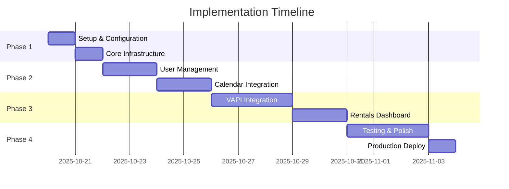

# Implementation Checklist - PeteRental Frontend

**Created:** October 20, 2025  
**Status:** 📋 Ready to Execute  
**Target:** Production-ready multi-user Next.js application

---

## 📊 Progress Overview



---

## 🎯 Phase 1: Setup & Configuration (Day 1)

### 1.1 Environment Configuration

- [ ] **Update .env.local with production backend**
  ```bash
  # .env.local
  NEXT_PUBLIC_API_URL=https://peterental-vapi-github-newer.onrender.com
  NEXT_PUBLIC_VAPI_PUBLIC_KEY=d8eb6604-8c1d-4cfa-ae55-c92f7304d1d4
  NEXT_PUBLIC_DEFAULT_USER_ID=mark@peterei.com
  NEXT_PUBLIC_ENVIRONMENT=production
  ```
- [ ] **Create .env.production**

  ```bash
  # .env.production
  NEXT_PUBLIC_API_URL=https://peterental-vapi-github-newer.onrender.com
  NEXT_PUBLIC_VAPI_PUBLIC_KEY=d8eb6604-8c1d-4cfa-ae55-c92f7304d1d4
  ```

- [ ] **Test backend connection**

  ```bash
  curl https://peterental-vapi-github-newer.onrender.com/health
  ```

- [ ] **Verify VAPI webhook URL** (in VAPI dashboard)
  ```
  https://peterental-vapi-github-newer.onrender.com/vapi/webhook
  ```

### 1.2 Type Definitions

- [ ] **Create comprehensive API types** (`src/types/api.ts`)

  - CalendarEvent
  - AvailabilitySlot
  - CalendarAuthStatus
  - VAPIAssistant
  - VAPIWebhookRequest
  - VAPIWebhookResponse
  - RentalProperty
  - DatabaseStats
  - APIResponse<T>
  - APIError types

- [ ] **Create user types** (`src/types/user.ts`)

  - User interface
  - AuthStatus interface
  - UserPreferences interface

- [ ] **Create VAPI types** (`src/types/vapi.ts`)

  - VAPICallState
  - VAPIMessage
  - VAPITranscript
  - AgentConfig

- [ ] **Update index.ts** to export all types

### 1.3 Configuration Files

- [ ] **Create site config** (`src/config/site.ts`)

  ```typescript
  export const siteConfig = {
    name: 'PeteRental',
    description: 'Rental property management with VAPI integration',
    url: 'https://peterental-nextjs.vercel.app',
    apiUrl: process.env.NEXT_PUBLIC_API_URL || 'http://localhost:8000',
  };
  ```

- [ ] **Create API config** (`src/config/api.ts`)
  ```typescript
  export const apiConfig = {
    baseURL: process.env.NEXT_PUBLIC_API_URL || 'http://localhost:8000',
    timeout: 30000,
    retries: 3,
  };
  ```

---

## 🏗️ Phase 2: Core Infrastructure (Day 2)

### 2.1 API Client Refactor

- [ ] **Create new API client structure**

  Files to create:

  - `src/lib/api/client.ts` - Main APIClient class
  - `src/lib/api/calendar.ts` - Calendar endpoints
  - `src/lib/api/vapi.ts` - VAPI endpoints
  - `src/lib/api/rentals.ts` - Rentals endpoints
  - `src/lib/api/errors.ts` - Error handling utilities

- [ ] **Implement APIError class**

  ```typescript
  export class APIError extends Error {
    constructor(
      public status: number,
      public message: string,
      public details?: unknown
    ) {
      super(message);
      this.name = 'APIError';
    }
  }
  ```

- [ ] **Implement response handler**

  ```typescript
  export async function handleAPIResponse<T>(response: Response): Promise<T> {
    if (!response.ok) {
      // Handle different error statuses
    }
    return response.json();
  }
  ```

- [ ] **Create API client with all methods**
  - calendar.getAuthStatus()
  - calendar.getEvents()
  - calendar.createEvent()
  - calendar.getAvailability()
  - vapi.getAssistants()
  - vapi.testWebhook()
  - rentals.getAvailable()
  - rentals.getByWebsite()
  - rentals.getStatus()
  - health()

### 2.2 Navigation Component Refactor

- [ ] **Convert navigation to Tailwind utilities**

  - Remove all inline styles
  - Use Tailwind classes
  - Add hover effects
  - Make responsive
  - Add active state indicators

- [ ] **Test navigation on all pages**
  - Verify active states
  - Check mobile responsiveness
  - Ensure accessibility (aria-labels)

### 2.3 Layout Updates

- [ ] **Create providers wrapper** (`src/app/providers.tsx`)

  ```typescript
  'use client';
  import { UserProvider } from '@/components/providers/user-provider';
  import { VAPIProvider } from '@/components/providers/vapi-provider';
  import { ToastProvider } from '@/components/providers/toast-provider';

  export function Providers({ children }: { children: React.ReactNode }) {
    return (
      <UserProvider>
        <VAPIProvider>
          <ToastProvider>{children}</ToastProvider>
        </VAPIProvider>
      </UserProvider>
    );
  }
  ```

- [ ] **Update root layout**
  - Wrap children with Providers
  - Ensure proper nesting
  - Test that providers load correctly

---

## 👤 Phase 3: User Management (Day 3-4)

### 3.1 User Provider

- [ ] **Create UserProvider** (`src/components/providers/user-provider.tsx`)

  Features:

  - Store userId in state
  - Load from localStorage on mount
  - checkAuthStatus() function
  - setUser() function
  - logout() function
  - isAuthenticated computed property
  - calendarConnected computed property

- [ ] **Create useUser hook** (`src/lib/hooks/use-user.ts`)

  ```typescript
  export function useUser() {
    const context = useContext(UserContext);
    if (!context) {
      throw new Error('useUser must be used within UserProvider');
    }
    return context;
  }
  ```

- [ ] **Test UserProvider**
  - Mount/unmount behavior
  - localStorage persistence
  - Context updates

### 3.2 Update Existing Pages

- [ ] **Update Home Page** (`src/app/page.tsx`)

  - Remove hardcoded userId
  - Use useUser() hook
  - Dynamic auth status check
  - Handle unauthenticated state

- [ ] **Update Users Page** (`src/app/users/page.tsx`)

  - Use useUser() hook
  - Handle OAuth callback
  - Show connection status
  - Add connect/disconnect buttons

- [ ] **Update Calendar Page** (`src/app/calendar/page.tsx`)

  - Use useUser() hook for userId
  - Show auth prompt if not connected
  - Dynamic data loading

- [ ] **Update Dashboard Page** (`src/app/dashboard/page.tsx`)
  - Use useUser() hook if needed
  - Display user-specific data

### 3.3 Authentication Components

- [ ] **Create ConnectCalendarButton** (`src/components/features/auth/connect-calendar.tsx`)

  - Check auth status
  - Redirect to OAuth flow
  - Show connection status
  - Handle errors

- [ ] **Create AuthStatus** (`src/components/features/auth/auth-status.tsx`)

  - Display auth status badge
  - Show expiry time
  - Refresh button
  - Disconnect button

- [ ] **Create UserSelector** (`src/components/features/auth/user-selector.tsx`)
  - List stored users
  - Switch between users
  - Add new user
  - Remove user

---

## 📅 Phase 4: Calendar Integration (Day 5-6)

### 4.1 Calendar Server Actions

- [ ] **Create calendar actions** (`src/lib/actions/calendar.ts`)

  Actions:

  - createAppointment()
  - getAvailability()
  - getEvents()
  - deleteEvent()

- [ ] **Implement revalidation**
  ```typescript
  revalidatePath('/calendar');
  revalidatePath('/dashboard');
  ```

### 4.2 Calendar Components

- [ ] **EventList** (`src/components/features/calendar/event-list.tsx`)

  - Display list of events
  - Show event details
  - Edit/delete buttons
  - Loading skeleton
  - Empty state

- [ ] **EventCard** (`src/components/features/calendar/event-card.tsx`)

  - Event details display
  - Time formatting (timezone-aware)
  - Attendee list
  - Action buttons
  - Calendar link

- [ ] **AppointmentScheduler** (`src/components/features/calendar/appointment-scheduler.tsx`)

  - Property address input
  - Date picker (shadcn/ui Calendar)
  - Time slot selection
  - Attendee information form
  - Submit button
  - Success/error feedback

- [ ] **AvailabilityPicker** (`src/components/features/calendar/availability-picker.tsx`)
  - Load available slots from API
  - Display as time buttons
  - Select slot
  - Pass selected time to parent

### 4.3 Calendar Page Updates

- [ ] **Update Calendar Page** (`src/app/calendar/page.tsx`)

  - Use Server Component for data
  - Pass data to Client Components
  - Add Suspense boundaries
  - Error boundary
  - Loading state

- [ ] **Create loading.tsx** (`src/app/calendar/loading.tsx`)

  - Skeleton for event list
  - Skeleton for scheduler

- [ ] **Create error.tsx** (`src/app/calendar/error.tsx`)
  - Error boundary UI
  - Retry button
  - Error message display

### 4.4 Timezone Handling

- [ ] **Create date utility functions** (`src/lib/utils/date.ts`)

  ```typescript
  export function formatAppointmentTime(date: Date): string {
    // Return ISO string (backend handles timezone)
  }

  export function displayAppointmentTime(isoString: string): string {
    // Display in user's local timezone
  }

  export function isValidDateTime(dateString: string): boolean {
    // Validate datetime format
  }
  ```

- [ ] **Test timezone handling**
  - Create appointment at 2 PM
  - Verify it appears at 2 PM in calendar
  - Test with different formats

---

## 🎙️ Phase 5: VAPI Integration (Day 7-9)

### 5.1 VAPI Provider

- [ ] **Create VAPIProvider** (`src/components/providers/vapi-provider.tsx`)

  Features:

  - Initialize Vapi SDK
  - Load agents from backend
  - Manage call state
  - Handle events (call-start, call-end, speech-start, speech-end)
  - Store transcript
  - Agent selection

- [ ] **Create useVAPI hook** (`src/lib/hooks/use-vapi.ts`)

- [ ] **Test VAPI provider**
  - SDK initialization
  - Event listeners
  - State updates

### 5.2 VAPI Components

- [ ] **AgentSelector** (`src/components/features/vapi/agent-selector.tsx`)

  - Fetch agents from API
  - Display as dropdown/cards
  - Show agent details (model, voice)
  - Select agent

- [ ] **VoiceInterface** (`src/components/features/vapi/voice-interface.tsx`)

  - Start/stop call buttons
  - Visual call state (active/inactive)
  - Speaking indicator
  - Connection status

- [ ] **CallControls** (`src/components/features/vapi/call-controls.tsx`)

  - Start call
  - End call
  - Mute/unmute
  - Volume control

- [ ] **TranscriptView** (`src/components/features/vapi/transcript-view.tsx`)
  - Display conversation transcript
  - Auto-scroll
  - Export transcript
  - Clear transcript

### 5.3 VAPI Agent Page

- [ ] **Update VAPI Agent Page** (`src/app/vapi-agent/page.tsx`)

  - Use VAPI provider
  - Show agent selector
  - Voice interface
  - Transcript view
  - Call history

- [ ] **Add VAPI testing functions**
  - Test get_availability
  - Test set_appointment
  - Test search_rentals
  - Display webhook responses

### 5.4 Multi-Agent Support

- [ ] **Implement agent switching**

  - Save current agent to context
  - Load agent configuration
  - Apply agent settings

- [ ] **Test with multiple agents**
  - Switch between agents
  - Verify correct agent loads
  - Test different agent capabilities

---

## 🏠 Phase 6: Rentals Dashboard (Day 10-11)

### 6.1 Rental Components

- [ ] **RentalCard** (`src/components/features/rentals/rental-card.tsx`)

  - Property details display
  - Price, bedrooms, bathrooms
  - Availability status
  - "Schedule Viewing" button
  - Property image (if available)

- [ ] **RentalList** (`src/components/features/rentals/rental-list.tsx`)

  - Grid/list view toggle
  - Display rental cards
  - Loading state
  - Empty state
  - Pagination

- [ ] **RentalFilters** (`src/components/features/rentals/rental-filters.tsx`)

  - Filter by price range
  - Filter by bedrooms
  - Filter by availability
  - Sort options
  - Apply filters button

- [ ] **PropertyViewer** (`src/components/features/rentals/property-viewer.tsx`)
  - Full property details
  - Gallery (if images)
  - Schedule viewing integration
  - Contact information

### 6.2 Dashboard Page Update

- [ ] **Update Dashboard Page** (`src/app/dashboard/page.tsx`)

  - Use Server Component for initial data
  - Add filters (URL state)
  - Pagination (URL state)
  - Integrate RentalList
  - Add status cards

- [ ] **Update StatusCards** (`src/components/dashboard/status-cards.tsx`)

  - Total rentals
  - Available now
  - Coming soon
  - Database stats

- [ ] **Update RentalTable** (`src/components/dashboard/rental-table.tsx`)
  - Use shadcn/ui Table
  - Sortable columns
  - Action buttons
  - Responsive design

### 6.3 Property Viewing Integration

- [ ] **Link rentals to calendar**
  - "Schedule Viewing" button opens scheduler
  - Pre-fill property address
  - Calendar modal/page
  - Success redirect

---

## 🎨 Phase 7: UI/UX Polish (Day 12-13)

### 7.1 Loading States

- [ ] **Create loading skeletons**

  - CalendarSkeleton
  - RentalCardSkeleton
  - EventListSkeleton
  - AgentSelectorSkeleton

- [ ] **Add loading.tsx to all routes**
  - /dashboard/loading.tsx
  - /calendar/loading.tsx
  - /users/loading.tsx
  - /vapi-agent/loading.tsx

### 7.2 Error Handling

- [ ] **Create error boundaries**

  - /dashboard/error.tsx
  - /calendar/error.tsx
  - /users/error.tsx
  - /vapi-agent/error.tsx

- [ ] **Error message components**
  - ErrorMessage component
  - Retry button
  - Contact support link

### 7.3 Toast Notifications

- [ ] **Create ToastProvider** (`src/components/providers/toast-provider.tsx`)

  - Success toasts
  - Error toasts
  - Info toasts
  - Warning toasts

- [ ] **Create useToast hook** (`src/lib/hooks/use-toast.ts`)

  ```typescript
  const { toast } = useToast();
  toast.success('Appointment created!');
  toast.error('Failed to load events');
  ```

- [ ] **Add toasts to all actions**
  - Appointment created
  - Auth success/failure
  - VAPI call started/ended
  - Errors

### 7.4 Responsive Design

- [ ] **Test on mobile**

  - Navigation mobile menu
  - Card layouts
  - Forms
  - Tables → cards on mobile

- [ ] **Test on tablet**

  - Grid layouts
  - Sidebars
  - Modals

- [ ] **Test on desktop**
  - Multi-column layouts
  - Hover states
  - Full features

### 7.5 Accessibility

- [ ] **Add ARIA labels**

  - Buttons
  - Forms
  - Navigation
  - Modals

- [ ] **Keyboard navigation**

  - Tab order
  - Enter to submit
  - Escape to close

- [ ] **Screen reader testing**
  - Test with VoiceOver/NVDA
  - Semantic HTML
  - Alt text for images

### 7.6 Dark Mode (Optional)

- [ ] **Add dark mode toggle**
- [ ] **Update all components for dark mode**
- [ ] **Test contrast ratios**

---

## 🧪 Phase 8: Testing (Day 14-15)

### 8.1 Backend Integration Testing

- [ ] **Test all API endpoints**

  ```bash
  # Health check
  curl https://peterental-vapi-github-newer.onrender.com/health

  # Auth status
  curl "https://peterental-vapi-github-newer.onrender.com/calendar/auth/status?user_id=mark@peterei.com"

  # Get events
  curl "https://peterental-vapi-github-newer.onrender.com/calendar/events?user_id=mark@peterei.com"

  # Get availability
  curl "https://peterental-vapi-github-newer.onrender.com/calendar/availability?user_id=mark@peterei.com"

  # VAPI assistants
  curl "https://peterental-vapi-github-newer.onrender.com/vapi/assistants"

  # Rentals
  curl "https://peterental-vapi-github-newer.onrender.com/database/available"
  ```

- [ ] **Test OAuth flow**

  - Start auth
  - Complete Microsoft OAuth
  - Verify callback
  - Check token storage

- [ ] **Test VAPI webhook**
  - get_availability function
  - set_appointment function
  - Verify calendar updates

### 8.2 Frontend Testing

- [ ] **Test user flows**

  - [ ] Home → Connect Calendar → Success
  - [ ] Calendar → View Events → Success
  - [ ] Calendar → Book Appointment → Success
  - [ ] Dashboard → View Rentals → Success
  - [ ] Rental → Schedule Viewing → Success
  - [ ] VAPI Agent → Start Call → Success

- [ ] **Test error handling**

  - [ ] Offline backend
  - [ ] Invalid user ID
  - [ ] Expired token
  - [ ] Network error
  - [ ] API error responses

- [ ] **Test edge cases**
  - [ ] No calendar events
  - [ ] No available slots
  - [ ] No rentals
  - [ ] Multiple users
  - [ ] Long property names
  - [ ] Special characters in input

### 8.3 Performance Testing

- [ ] **Run Lighthouse audit**

  - Performance > 90
  - Accessibility > 95
  - Best Practices > 90
  - SEO > 90

- [ ] **Check Core Web Vitals**

  - LCP < 2.5s
  - FID < 100ms
  - CLS < 0.1

- [ ] **Test bundle size**
  ```bash
  pnpm build
  # Check .next/static/chunks sizes
  ```

### 8.4 Browser Testing

- [ ] **Test on Chrome**
- [ ] **Test on Firefox**
- [ ] **Test on Safari**
- [ ] **Test on Edge**
- [ ] **Test on mobile browsers**

---

## 🚀 Phase 9: Production Deployment (Day 16)

### 9.1 Pre-deployment Checklist

- [ ] **Run type check**

  ```bash
  pnpm run build
  ```

- [ ] **Run linter**

  ```bash
  pnpm run lint
  ```

- [ ] **Check for console errors**

  - No console.log in production
  - No errors in browser console

- [ ] **Verify environment variables**

  - .env.local for development
  - Vercel env vars for production

- [ ] **Test production build locally**
  ```bash
  pnpm build && pnpm start
  ```

### 9.2 Vercel Deployment

- [ ] **Update Vercel environment variables**

  ```
  NEXT_PUBLIC_API_URL=https://peterental-vapi-github-newer.onrender.com
  NEXT_PUBLIC_VAPI_PUBLIC_KEY=d8eb6604-8c1d-4cfa-ae55-c92f7304d1d4
  ```

- [ ] **Deploy to Vercel**

  ```bash
  git push origin main
  # Or use Vercel CLI
  vercel --prod
  ```

- [ ] **Verify deployment**
  - Check Vercel deployment logs
  - Visit production URL
  - Test all pages
  - Check analytics

### 9.3 Post-deployment Testing

- [ ] **Smoke test production**

  - [ ] Home page loads
  - [ ] Can connect calendar
  - [ ] Can view events
  - [ ] Can book appointment
  - [ ] VAPI agent works
  - [ ] Dashboard loads rentals

- [ ] **Check error tracking**
  - Setup Sentry (optional)
  - Monitor errors
  - Fix critical issues

### 9.4 Documentation

- [ ] **Update README.md**

  - Setup instructions
  - Environment variables
  - Development workflow
  - Deployment process

- [ ] **Create API documentation**

  - Available endpoints
  - Request/response examples
  - Error codes

- [ ] **Create user guide**
  - How to connect calendar
  - How to book appointments
  - How to use VAPI agent

---

## 📊 Success Metrics

### Technical Metrics

- ✅ TypeScript: 100% type coverage
- ✅ Linting: 0 errors
- ✅ Build: Success in < 2 minutes
- ✅ Lighthouse: > 90 on all metrics
- ✅ Bundle size: < 300KB initial load

### User Metrics

- ✅ Time to connect calendar: < 30 seconds
- ✅ Time to book appointment: < 2 minutes
- ✅ Page load time: < 2 seconds
- ✅ Error rate: < 1%
- ✅ User satisfaction: > 4.5/5

### Business Metrics

- ✅ Support 1-100,000 users
- ✅ 99.9% uptime
- ✅ < 500ms API response time
- ✅ 0 security vulnerabilities

---

## 🔄 Maintenance Tasks

### Daily

- [ ] Check error logs
- [ ] Monitor API uptime
- [ ] Review user feedback

### Weekly

- [ ] Update dependencies
- [ ] Review analytics
- [ ] Backup data

### Monthly

- [ ] Security audit
- [ ] Performance review
- [ ] Feature planning

---

## 📝 Notes

### Important Reminders

- Always test with real backend, never mock
- Keep user ID dynamic, never hardcode
- Use Tailwind utilities, no inline styles
- Prefer Server Components over Client Components
- Handle all errors gracefully
- Make everything responsive
- Ensure accessibility

### Common Pitfalls to Avoid

- ❌ Hardcoding user IDs
- ❌ Using `any` type
- ❌ Inline styles
- ❌ Missing error handling
- ❌ Not handling loading states
- ❌ Forgetting to test on mobile
- ❌ Not checking accessibility

### Resources

- Backend API: https://peterental-vapi-github-newer.onrender.com/docs
- VAPI Docs: https://docs.vapi.ai
- Next.js Docs: https://nextjs.org/docs
- shadcn/ui: https://ui.shadcn.com
- Tailwind CSS: https://tailwindcss.com/docs

---

**End of Implementation Checklist**

**Status:** Ready to execute  
**Estimated Time:** 16 days  
**Team Size:** 1 developer  
**Next Action:** Start Phase 1, Task 1.1
