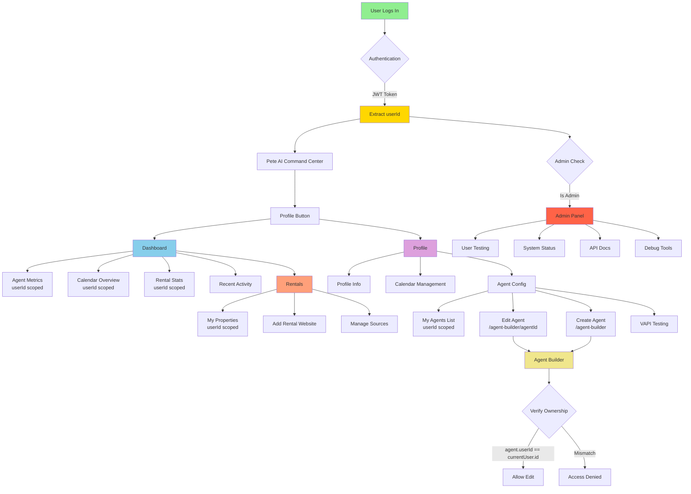

# UI Reorganization Plan

**Date:** 2025-10-29  
**Status:** Planning Phase  
**Goal:** Transform frontend into user-centric Pete AI Command Center

---

## 📋 Executive Summary

Reorganize the entire frontend to be:

1. **User-centric** - Everything scoped to the logged-in user
2. **Analytical** - Dashboard shows metrics and insights
3. **Agent-focused** - VAPI/agent management is core to profile
4. **Multi-tenant ready** - userId → companyId nesting prepared
5. **Admin-separated** - Debug/testing tools in dedicated admin area

---

## 🎯 Required Changes

### 1. Homepage (/) - "Pete AI Command Center"

**Current State:**

- Title: "PeteRental Next.js 15.4"
- Buttons: "Get Started", "View API Docs", "View Rentals", etc.

**New State:**

- Title: **"Pete AI Command Center"**
- Primary button: **"Profile"** (not "Connect Calendar")
- Remove: "View API Docs", "View Rentals", "Calendar Events"
- Remove: "What's Working" section
- Keep: Clean, focused landing page with single CTA

**Changes:**

```typescript
// src/app/page.tsx
- <h1>PeteRental Next.js 15.4</h1>
+ <h1>Pete AI Command Center</h1>

- <Button>Connect Calendar</Button>
+ <Button href="/users">Profile</Button>

- Remove API docs, rentals, calendar buttons
- Remove "What's Working" section
```

---

### 2. Dashboard (/dashboard) - Analytics & Overview

**Current State:**

- Basic layout with greeting
- Placeholder cards
- No real data

**New State:**

- **User-scoped analytics dashboard**
- **Metrics to show:**
  - Number of agents configured
  - Active agents / Inactive agents
  - Calendar connection status
  - Upcoming appointments (next 7 days)
  - Rental properties count
  - Recent agent activity
  - Calendar utilization (bookings this month)

**Data Sources:**

- `/api/users/current` - User info, calendar status
- `/agent-builder` data - User's agents
- `/calendar/events` - Upcoming appointments
- `/rentals` - User's properties

**Layout:**

```
┌─────────────────────────────────────────┐
│  Welcome back, Mark! 👋                 │
│  Your command center overview           │
└─────────────────────────────────────────┘

┌──────────────┬──────────────┬──────────────┐
│  📱 Agents   │  📅 Calendar │  🏠 Rentals  │
│  3 Active    │  5 Events    │  12 Props    │
│  1 Inactive  │  Next: Today │  Available   │
└──────────────┴──────────────┴──────────────┘

┌─────────────────────────────────────────┐
│  Recent Activity                         │
│  • Agent "Property Bot" handled 3 calls │
│  • Calendar sync: 2 hours ago           │
│  • New rental added: 1 day ago          │
└─────────────────────────────────────────┘

┌─────────────────────────────────────────┐
│  Quick Actions                           │
│  [Configure Agent] [View Calendar] [Add]│
└─────────────────────────────────────────┘
```

**Changes:**

```typescript
// src/app/dashboard/page.tsx
- Static placeholder cards
+ Dynamic data fetching from:
  - useCurrentUser() → calendar, user info
  - getAgents() → agent count, status
  - getCalendarEvents(7) → upcoming appointments
  - getRentals() → property count
```

---

### 3. Profile (/users) - User Hub with Agent Config

**Current State:**

- **Tabs:** Profile, Calendar, VAPI Config
- VAPI Config tab links to Agent Builder
- Calendar connection UI

**New State:**

- **Tabs:** Profile, Calendar, Agent Config (renamed from VAPI Config)
- **Agent Config tab becomes full management:**
  - List of user's agents
  - "Edit Agent" buttons → `/agent-builder/[agentId]`
  - "Create New Agent" → `/agent-builder`
  - Agent status (active/inactive)
  - Last activity
  - Quick test interface
- **Move VAPI testing tools here** (from separate page)

**Changes:**

```typescript
// src/app/users/page.tsx

// Tab 3: VAPI Config → Agent Config
<TabsContent value="agent-config">
  <Card>
    <CardHeader>
      <CardTitle>Agent Configuration</CardTitle>
      <CardDescription>
        Manage your voice AI agents and configurations
      </CardDescription>
    </CardHeader>
    <CardContent>
      {/* List user's agents */}
      {userAgents.map((agent) => (
        <AgentCard
          key={agent.id}
          agent={agent}
          onEdit={() => router.push(`/agent-builder/${agent.id}`)}
          onTest={() => testAgent(agent.id)}
        />
      ))}

      <Button href="/agent-builder">
        <Plus /> Create New Agent
      </Button>

      {/* VAPI Testing Interface (moved from /vapi-testing) */}
      <VAPITestInterface />
    </CardContent>
  </Card>
</TabsContent>
```

---

### 4. Agent Builder (/agent-builder) - User's Agents

**Current State:**

- Shows all agents (not filtered by user)
- Create new agent flow
- Edit agent at `/agent-builder/[id]`

**New State:**

- **User-scoped agent list**
- Filter: `agents.where(user_id = currentUser.id)`
- Display agent cards with:
  - Agent name
  - VAPI assistant ID
  - Status (active/inactive)
  - Last used
  - Quick actions (Edit, Delete, Test)
- "Create New Agent" prominent button

**Changes:**

```typescript
// src/app/agent-builder/page.tsx

// Fetch only user's agents
const { agents } = await getAgents({ userId: currentUser.id });

// Display user's agents only
{
  agents.length === 0 ? (
    <EmptyState>
      <p>You haven't created any agents yet</p>
      <Button href="/agent-builder/new">Create Your First Agent</Button>
    </EmptyState>
  ) : (
    <AgentGrid>
      {agents.map((agent) => (
        <AgentCard
          key={agent.id}
          agent={agent}
          onEdit={() => router.push(`/agent-builder/${agent.id}`)}
        />
      ))}
    </AgentGrid>
  );
}
```

**Edit Agent Page:**

```typescript
// src/app/agent-builder/[id]/page.tsx

// Verify agent belongs to user
const agent = await getAgent(params.id);
if (agent.user_id !== currentUser.id) {
  return <AccessDenied />;
}

// Show edit form
<AgentEditForm agent={agent} />;
```

---

### 5. Rentals (/rentals) - User's Properties

**Current State:**

- Mock rental data
- Search and filters
- Not user-scoped yet

**New State:**

- **User-scoped rentals** - `user_id` filter
- **Add "Add Rental Website" button**
- **Form to add rental sources:**
  - Website URL
  - Scraping config
  - Auto-sync settings
- **Nested under userId** (later companyId)
- **Rental management:**
  - Add/edit/delete rentals
  - Mark as available/unavailable
  - Track which agent handles each property

**Changes:**

```typescript
// src/app/rentals/page.tsx

// Add "Add Source" button
<Button onClick={() => setShowAddSourceModal(true)}>
  <Plus /> Add Rental Website
</Button>

// Modal to add rental source
<AddRentalSourceModal
  onSubmit={(url, config) => {
    // POST /rentals/sources
    // { user_id, website_url, scraping_config }
  }}
/>

// Fetch user's rentals only
const rentals = await fetch(`/api/rentals?user_id=${userId}`)

// Later: Company grouping
const rentals = await fetch(`/api/rentals?company_id=${companyId}`)
```

---

### 6. Admin Tab - Debug & Testing

**Current State:**

- `/admin/testing` exists
- "What's Working" on homepage
- Various debug pages scattered

**New State:**

- **Consolidate into `/admin` section**
- **Tabs:**
  - Testing (user switching)
  - System Status ("What's Working")
  - API Docs
  - Debug Tools
- **Access:** Admin only
- **Navigation:** Only visible to admins

**New Structure:**

```
/admin
  ├── /testing        → User switching, impersonation
  ├── /status         → "What's Working" info
  ├── /api-docs       → API endpoint documentation
  └── /debug          → Clerk debug, logs, etc.
```

**Changes:**

```typescript
// src/app/admin/page.tsx (new)
<Tabs>
  <TabsList>
    <TabsTrigger value="testing">User Testing</TabsTrigger>
    <TabsTrigger value="status">System Status</TabsTrigger>
    <TabsTrigger value="api-docs">API Docs</TabsTrigger>
    <TabsTrigger value="debug">Debug Tools</TabsTrigger>
  </TabsList>

  <TabsContent value="testing">
    {/* Current /admin/testing content */}
  </TabsContent>

  <TabsContent value="status">{/* Move "What's Working" here */}</TabsContent>

  <TabsContent value="api-docs">
    {/* Move /api-endpoints content here */}
  </TabsContent>

  <TabsContent value="debug">
    {/* Move /debug-clerk content here */}
  </TabsContent>
</Tabs>
```

---

## 📊 Current vs. New Structure

### Current Navigation

```
Home
  ├── Get Started
  ├── View API Docs ❌
  ├── View Rentals ❌
  └── Calendar Events ❌

Dashboard (basic)

Profile
  ├── Profile Info
  ├── Calendar
  └── VAPI Config → Links to Agent Builder

Agent Builder
  └── All agents (not filtered)

Calendar Events

Rentals

Admin Testing

What's Working ❌
Debug Clerk ❌
Test Suite ❌
```

### New Navigation

```
Home ("Pete AI Command Center")
  └── Profile (single CTA)

Dashboard (Analytics)
  ├── Agent Metrics
  ├── Calendar Overview
  ├── Rental Stats
  └── Recent Activity

Profile
  ├── Profile Info
  ├── Calendar Management
  └── Agent Config
      ├── My Agents List
      ├── Edit Agent → /agent-builder/[id]
      ├── Create Agent → /agent-builder
      └── VAPI Testing Interface

Agent Builder
  ├── My Agents (user-scoped)
  └── Create/Edit (user-scoped)

Calendar Events

Rentals (user-scoped)
  ├── My Properties
  ├── Add Rental Website
  └── Manage Sources

Admin (admin-only)
  ├── User Testing
  ├── System Status
  ├── API Docs
  └── Debug Tools
```

---

## 🗂️ File Changes Summary

### Files to Create

```
src/app/admin/page.tsx                    # Admin hub with tabs
src/app/admin/status/page.tsx             # System status (What's Working)
src/app/admin/api-docs/page.tsx           # API documentation
src/app/admin/debug/page.tsx              # Debug tools
src/components/dashboard/AnalyticsDashboard.tsx  # New analytics dashboard
src/components/dashboard/AgentMetrics.tsx        # Agent statistics
src/components/dashboard/CalendarOverview.tsx    # Calendar summary
src/components/dashboard/RentalStats.tsx         # Rental statistics
src/components/rentals/AddSourceModal.tsx        # Add rental website
src/components/agents/AgentCard.tsx              # Agent display card
src/components/agents/AgentList.tsx              # User's agent list
src/components/vapi/VAPITestInterface.tsx        # Testing interface
```

### Files to Modify

```
src/app/page.tsx                          # Homepage → Command Center
src/app/dashboard/page.tsx                # Basic → Analytics
src/app/users/page.tsx                    # Add Agent Config tab
src/app/agent-builder/page.tsx            # User-scoped agents
src/app/agent-builder/[id]/page.tsx       # Verify ownership
src/app/rentals/page.tsx                  # Add source management
src/components/navigation.tsx             # Update nav links
```

### Files to Move/Remove

```
src/app/whats-working/page.tsx            → Move to /admin/status
src/app/api-endpoints/page.tsx            → Move to /admin/api-docs
src/app/debug-clerk/page.tsx              → Move to /admin/debug
src/app/test-suite/page.tsx               → Move to /admin (maybe)
src/app/vapi-testing/page.tsx             → Integrate into /users (Agent Config tab)
```

---

## 🔄 Data Flow Changes

### Before (Current)

```
User
  ↓
Homepage (static)
  ↓
Dashboard (placeholder)
  ↓
Agent Builder (all agents)
  ↓
Rentals (mock data)
```

### After (New)

```
User Authentication
  ↓
  ├─→ userId extracted from JWT
  │
  ├─→ Dashboard
  │     ├─→ fetch('/api/users/current')  → user info
  │     ├─→ fetch('/api/agents?userId')  → user's agents
  │     ├─→ fetch('/api/calendar/events') → appointments
  │     └─→ fetch('/api/rentals?userId')  → user's rentals
  │
  ├─→ Profile (/users)
  │     ├─→ Profile Info
  │     ├─→ Calendar Management
  │     └─→ Agent Config
  │           ├─→ fetch('/api/agents?userId')
  │           ├─→ Edit agent → /agent-builder/[agentId]
  │           └─→ Test interface
  │
  ├─→ Agent Builder
  │     ├─→ fetch('/api/agents?userId') → filter by userId
  │     ├─→ POST /api/agents { userId, ... }
  │     └─→ PATCH /api/agents/[id] (verify userId)
  │
  └─→ Rentals
        ├─→ fetch('/api/rentals?userId') → user-scoped
        ├─→ POST /api/rentals/sources { userId, websiteUrl }
        └─→ Later: ?companyId instead
```

---

## 📐 ASCII Diagram

### Current Architecture

```
┌─────────────────────────────────────────────────────────┐
│                      HOMEPAGE (/)                        │
│  - Get Started                                          │
│  - View API Docs                                        │
│  - View Rentals                                         │
│  - Calendar Events                                      │
│  - What's Working                                       │
└──────────────────────┬──────────────────────────────────┘
                       │
        ┌──────────────┼──────────────┬──────────────┐
        │              │              │              │
        ▼              ▼              ▼              ▼
  ┌─────────┐   ┌───────────┐  ┌──────────┐  ┌──────────┐
  │Dashboard│   │  Profile  │  │ Agents   │  │ Rentals  │
  │(basic)  │   │           │  │(all)     │  │(mock)    │
  └─────────┘   └─────┬─────┘  └──────────┘  └──────────┘
                      │
              ┌───────┼───────┐
              │       │       │
              ▼       ▼       ▼
          Profile Calendar  VAPI
                             ├─→ Links to Agent Builder
```

### New Architecture

```
┌─────────────────────────────────────────────────────────┐
│         PETE AI COMMAND CENTER (/)                      │
│                                                          │
│         [Profile] ← Single CTA                          │
│                                                          │
└──────────────────────┬──────────────────────────────────┘
                       │
                       ▼
              ┌─────────────────┐
              │   userId from   │
              │   Clerk JWT     │
              └────────┬─────────┘
                       │
        ┌──────────────┼──────────────┬──────────────┐
        │              │              │              │
        ▼              ▼              ▼              ▼
  ┌───────────┐  ┌──────────┐  ┌──────────┐  ┌──────────┐
  │ Dashboard │  │ Profile  │  │  Agents  │  │ Rentals  │
  │(Analytics)│  │          │  │(userId)  │  │(userId)  │
  └─────┬─────┘  └────┬─────┘  └────┬─────┘  └────┬─────┘
        │             │             │             │
        │      ┌──────┴──────┬──────┴──────┐      │
        │      │             │             │      │
        ▼      ▼             ▼             ▼      ▼
    Metrics  Profile   Agent Config   Create  Add Source
             Calendar  ├─ My Agents   /Edit   Manage
                       ├─ Edit Agent
                       └─ Test VAPI


                       Admin Only
                       ┌──────────┐
                       │  Admin   │
                       │  Panel   │
                       └────┬─────┘
                            │
                    ┌───────┼────────┬─────────┐
                    │       │        │         │
                    ▼       ▼        ▼         ▼
                Testing  Status  API Docs  Debug
```

---

## 🎨 Mermaid Flow Diagram



---

## 🔐 Multi-Tenant Data Scoping

### Current (Partial)

```typescript
// Some endpoints user-scoped, some not
GET /calendar/events  ✅ User-scoped (JWT)
GET /agents           ❌ Not filtered
GET /rentals          ❌ Mock data
```

### New (All User-Scoped)

```typescript
// All data filtered by userId from JWT
GET /dashboard/stats?userId={from JWT}
  → {
      agents: { total, active, inactive },
      calendar: { events_count, next_event },
      rentals: { total, available }
    }

GET /agents?userId={from JWT}
  → [ { id, name, vapi_id, user_id, status } ]

GET /rentals?userId={from JWT}
  → [ { id, address, price, user_id } ]

// Later: Company-scoped
GET /rentals?companyId={from JWT}
  → [ { id, address, price, company_id, user_id } ]
```

---

## 📋 Implementation Checklist

### Phase 1: Homepage & Navigation

- [ ] Update homepage title to "Pete AI Command Center"
- [ ] Change primary button to "Profile"
- [ ] Remove API Docs, Rentals, Calendar buttons
- [ ] Remove "What's Working" section
- [ ] Update navigation component
- [ ] Test routing

### Phase 2: Dashboard Transformation

- [ ] Create Analytics dashboard component
- [ ] Add Agent Metrics card
- [ ] Add Calendar Overview card
- [ ] Add Rental Stats card
- [ ] Add Recent Activity feed
- [ ] Fetch user-scoped data
- [ ] Test data display

### Phase 3: Profile Enhancement

- [ ] Rename "VAPI Config" → "Agent Config"
- [ ] Create user agents list component
- [ ] Add "Edit Agent" buttons linking to `/agent-builder/[id]`
- [ ] Add "Create New Agent" button
- [ ] Move VAPI testing interface here
- [ ] Test agent management flow

### Phase 4: Agent Builder User-Scoping

- [ ] Filter agents by userId
- [ ] Add ownership verification to edit page
- [ ] Create empty state for no agents
- [ ] Add prominent "Create Agent" button
- [ ] Test user-scoped agent list
- [ ] Test edit ownership check

### Phase 5: Rentals Enhancement

- [ ] Add "Add Rental Website" button
- [ ] Create add source modal
- [ ] Implement source management
- [ ] Filter rentals by userId
- [ ] Test rental creation
- [ ] Prepare for companyId nesting

### Phase 6: Admin Consolidation

- [ ] Create `/admin` hub page
- [ ] Move Testing to `/admin` (tab)
- [ ] Move "What's Working" to `/admin/status`
- [ ] Move API Docs to `/admin/api-docs`
- [ ] Move Debug tools to `/admin/debug`
- [ ] Update navigation (admin-only visibility)
- [ ] Test admin access control

---

## ⚠️ Potential Issues & Solutions

### Issue 1: Agent Ownership

**Problem:** Users could edit others' agents via direct URL  
**Solution:** Add ownership check in `/agent-builder/[id]` page

```typescript
if (agent.user_id !== currentUser.id) {
  return <AccessDenied />;
}
```

### Issue 2: Dashboard Data Loading

**Problem:** Multiple API calls on dashboard load  
**Solution:** Use React Query or parallel fetching

```typescript
const { data: analytics } = await Promise.all([
  fetch('/api/dashboard/agents'),
  fetch('/api/dashboard/calendar'),
  fetch('/api/dashboard/rentals'),
]);
```

### Issue 3: Navigation State

**Problem:** Active tab confusion with new structure  
**Solution:** Update `isActive` logic in navigation

```typescript
const isActive = (href) => {
  if (href === '/admin') return pathname.startsWith('/admin');
  // ... rest
};
```

---

## 🚀 Deployment Strategy

1. **Commit checkpoint** ✅ Done
2. **Create feature branch** `git checkout -b ui-reorganization`
3. **Implement phase by phase**
4. **Test each phase** before moving to next
5. **Create PR** with before/after screenshots
6. **Review and merge**
7. **Deploy to production**

---

## 📊 Success Metrics

After implementation, we should see:

- [ ] Cleaner, more focused homepage
- [ ] User-centric dashboard with real metrics
- [ ] Streamlined agent management in profile
- [ ] Clear user-scoping on all data
- [ ] Admin tools consolidated
- [ ] Improved UX for primary flows

---

**Next Step:** Review this plan, then implement phase by phase!
